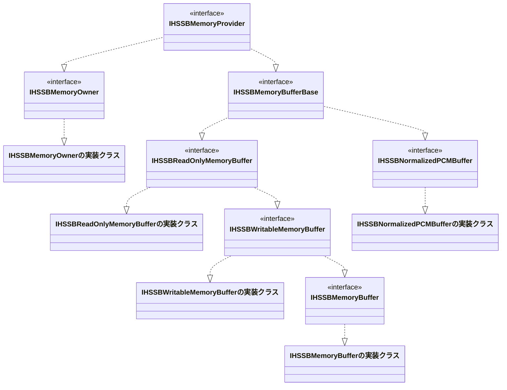

# HSSoundBasisLib ライブラリ

※ 以下の内容は、一部AI向け(Microsoft365 Copilot / GitHub Copilot) 向けの説明が含まれています。

## 概要

HSSoundBasisLibは、音声処理のための基本的な機能を提供するC++ライブラリです。
また、安全なメモリ管理システムも備えています。

※ 現段階ではメモリ管理システムを優先に実装している影響で、音声処理機能は未実装です。

## 対象とする環境

* OS : Windows x86/x64のみ
  - 動作確認済みOS : Windows 11 (x64)

* IDE : Visual Studio 2026以降

## ビルド方法

以下の方法でビルドされることを想定しております。

### 方法1

* 親フォルダにあるソリューションファイル(SoundProcessCpp.slnx)をVisual Studio 2026以降で開き、ビルドしてください
  - リリースビルド、デバッグビルドの両方に対応しています
  - サンプルを含めてビルドされます

### 方法2

* 任意のソリューションを作成し、『`HSSoundBasisLib.vcxproj`』を参加させてビルドしてください
  - リリースビルド、デバッグビルドの両方に対応しています
  - このフォルダ配下のファイルをソリューションフォルダにコピーすることを推奨します

## インストール方法

* TBD

## ライセンス

[LICENSE](../../../LICENSE) ファイルを参照してください。

## 実装コンセプト

* 本ライブラリ単体で完結するよう、サードパーティ製のライブラリは使用しない
  - ただし、Visual Studioに統合されているものは使用可能
  - OpenMPはVisual C++に統合されているため使用可能
  - C++標準ライブラリは使用可能
  - Windows SDKに含まれるAPIは使用可能

* 実装上クラスになるものはCOMインタフェースライクの実装として提供する
  - これらは、IUnknownインタフェースを継承し、参照カウント方式のメモリ管理を行う
    - これにより、CComPtrなどの既存のスマートポインタを使用して安全に管理できる
  - インスタンス作成は専用のファクトリ関数を提供する

## 提供される機能の特徴 (実装予定含む)

### メモリ管理システム

---

以下、クラス図による関係イメージ図になります。なお、実装クラスの実態はライブラリ内で隠蔽されており、 
そのインスタンスは専用のファクトリ関数を通じて取得/作成する形になります。

下図においてライブラリ内で実態が実装されているものは 『(インタフェース名) + の実装クラス』と表記しています 
そのため、それらは実際のクラス名とは異なり説明用の記載となります。

また、メンバ関数の記載は省略しています。

以下、提供されるインタフェースの説明です
  
#### IHSSBMemoryOwnerインタフェース

* IHSSBMemoryOwnerインタフェースは、メモリ所有者を表すインタフェースです
* new[],malloc,HeapAllocで確保したメモリの管理権を本インタフェースに移譲可能です
  - 管理権が移譲された場合は、インスタンスは破棄時にメモリを解放されます
* 内部でメモリサイズを管理していますので、関数等に渡す際にサイズ情報を別途パラメータで指定する必要がありません

#### IHSSBReadOnlyMemoryBufferインタフェース

* IHSSBReadOnlyMemoryBufferインタフェースは、読み取り専用のメモリバッファを表すインタフェースです
* IHSSBMemoryOwnerインタフェースと同機能のメモリ所有者機能を備えています
  - IHSSBMemoryOwnerインタフェースを利用する方法へ変更予定です
    - これは、IHSSBMemoryOwnerインタフェース実装前に本インタフェースが実装されたためです
* メモリバッファの内容を変更することはできません

#### IHSSBWritableMemoryBufferインタフェース

* IHSSBWritableMemoryBufferインタフェースは、書き込み可能なメモリバッファを表すインタフェースです
* 現在は、メモリ所有者機能を備えていません
  - IHSSBMemoryOwnerインタフェースを利用する方法へ変更予定です

#### IHSSBMemoryBufferインタフェース

* IHSSBMemoryBufferインタフェースは、読み取り/書き込み可能なメモリバッファを表すインタフェースです
* 現在は、メモリ所有者機能を備えておらず、所有者は本インタフェースです
* メモリバッファの内容を読み書き可能です
* メモリバッファのサイズを変更可能です
* メモリバッファの内容を他のメモリバッファへコピー可能です
* メモリバッファの内容を他のメモリバッファからコピー可能です

#### IHSSBNormalizedPCMBufferインタフェース

* IHSSBNormalizedPCMBufferインタフェースは、正規化されたPCM音声データを表すインタフェースです
* 64bit浮動小数点数形式で音声データを保持します
* チャンネル数、サンプル数の情報を保持します

### WAVEファイル入出力 (未実装)

WAVEファイルの読み書きを行うためのインタフェースを提供予定です。
また、関連して汎用的なRIFFファイルの読み書きもインタフェースも提供予定です。

* 以下、予定しているインタフェース名
  - IHSSBRiffFileReader : RIFFファイルの読み込みを行うインタフェース
  - IHSSBRiffFileWriter : RIFFファイルの書き込みを行うインタフェース
  - IHSSBWaveFileReader : WAVEファイルの読み込みを行うインタフェース
  - IHSSBWaveFileWriter : WAVEファイルの書き込みを行うインタフェース
  - IHSSBWaveFileDataChunkReader : WAVEファイルのデータチャンク読み込みを行うインタフェース

* 対応フォーマットは以下を予定

  |フォーマットID(WAVEFORMATEX::wFormatTag)|フォーマット名|量子化ビット数|チャンネル数|サンプリングレート|
  |---|---|---|---|---|
  |WAVE_FORMAT_PCM|PCM|8bit/16bit/24bit/32bit|モノラル、ステレオ|任意|
  |WAVE_FORMAT_IEEE_FLOAT|IEEE Float|32bit/64bit|モノラル、ステレオ|任意|
  |WAVE_FORMAT_MULAW|μ-law|8bit|モノラル、ステレオ|任意|
  |WAVE_FORMAT_ALAW|A-law|8bit|モノラル、ステレオ|任意|

### フォーマット変換関連 (未実装)

* PCM/IEEE Float/A-law/μ-law間のフォーマット変換を行うための機能を提供予定です
  - 簡略化するため一度正規化を経由するものとします
    - 例：PCM → 正規化 → IEEE Float
  
* リサンプリングを行うための機能を提供予定です

### 音声処理関連 (未実装)

* 速度変更を行うための機能を提供予定です
* FFT/IFFTを行うための機能を提供予定です

### Logger関連 (未実装)

* 先に記載したように、本ライブラリ単体で完結するように設計されているため、サードパーティ製のロガーライブラリは使用しません
  - そのため、独自のロガーインタフェースを提供予定です

* また、できるだけログのファイルサイズを抑えられるように、独自形式のログファイルフォーマットを採用予定です
  - ログファイルフォーマットの仕様は以下にまとめてあります (※ 検討中な部分もあり、現時点では確定していません)
    - [HSSBLogger_LogFileFormatSpec.md](./specifications/HSSBLogger_LogFileFormatSpec.md)

* 以下、予定している機能です
  - ログレベル設定機能
  - 先述した独自形式のログファイルへの出力機能
    - 該当ログファイルのパーサー or リーダーのインタフェースも提供予定です
  - ログローテーション機能
  - 1ログファイルあたり、1モジュールとして扱う予定です
    - モジュールごとにログレベルを設定可能にする予定です
    - 1モジュール当たり、複数のサブモジュール（メインモジュールを含めて最大256個を予定）を持てるようにする予定です
      - サブモジュールごとにログレベルを設定可能にする予定です

* 以下、検討している機能です
  - コンソール出力機能

### その他

* IHSSBWin32HandleOwnerインタフェース (未実装)
  - IHSSBMemoryOwnerのハンドルバージョンとなり、Win32のハンドルを安全に管理するためのインタフェース
  - ハンドルのクローズ処理を自動化します

## APIドキュメント

* 現在は未実装ですが、ヘッダーファイル内に、Natural Docs形式でコメントを記述予定です。
  - **ただし、現在Doxygenとの比較を行っており、最終的にDoxygenに変更する可能性があります**
  - **そのため、確定するまで、リポジトリ上に投稿されるコード内のコメントは双方が混在している場合があります**

