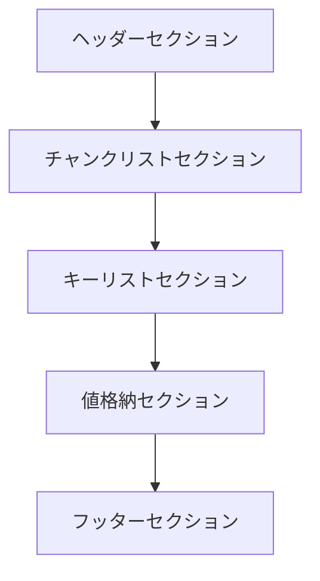

# HSSB Configuration Binary File Format 仕様書


このファイルは、HSSoundBasisLib ライブラリで使用される設定ファイルのバイナリフォーマット仕様について説明します。

> [!NOTE]
> HSSoundBasisLibライブラリでは IHSSBConfigurator インターフェースを通じて設定ファイルの読み書きを行う予定です。


## 目次


1. [目次](#目次)
2. [コンセプト](#コンセプト)
3. [事前知識](#事前知識)
   1. [想定している利用環境などについて](#想定している利用環境などについて)
   2. [エンディアンについて](#エンディアンについて)
   3. [wchar\_t型について](#wchar_t型について)
   4. [SHA-256ハッシュ値について](#sha-256ハッシュ値について)
   5. [構造の表記方法について](#構造の表記方法について)
   6. [UUIDについて](#uuidについて)
   7. [可変長データにおけるサイズ指定について](#可変長データにおけるサイズ指定について)
   8. [本仕様書で記載する構造体の接頭辞について](#本仕様書で記載する構造体の接頭辞について)
   9. [各種識別子一覧](#各種識別子一覧)
4. [独自の型定義](#独自の型定義)
   1. [日時構造体 (HSSBLoggerDateTime)](#日時構造体-hssbloggerdatetime)
      1. [DateInMJD](#dateinmjd)
      2. [TimeInMilliseconds](#timeinmilliseconds)
   2. [共通セクションヘッダー構造体](#共通セクションヘッダー構造体)
      1. [SectionID](#sectionid)
      2. [SectionSize](#sectionsize)
5. [ファイル構造](#ファイル構造)
   1. [ヘッダーセクション](#ヘッダーセクション)
   2. [チャンクリストセクション](#チャンクリストセクション)
   3. [キーリストセクション](#キーリストセクション)
   4. [値格納セクション](#値格納セクション)
   5. [フッターセクション](#フッターセクション)


## コンセプト

まず、[HSSoundBasisLibのReadme](../../README.md)に記載しました通り、以下の実装コンセプトで
実装しております。

* HSSoundBasisLibの実装コンセプト
  - 本ライブラリ単体で完結するよう、サードパーティ製のライブラリは使用しない
    - ただし、Visual Studioに統合されているものは使用可能
    - OpenMPはVisual C++に統合されているため使用可能
    - C++標準ライブラリは使用可能
    - Windows SDKに含まれるAPIは使用可能
  - 実装上クラスになるものはCOMインタフェースライクの実装として提供する
    - これらは、IUnknownインタフェースを継承し、参照カウント方式のメモリ管理を行う
      - これにより、CComPtrなどの既存のスマートポインタを使用して安全に管理できる
    - インスタンス作成は専用のファクトリ関数を提供する
  - **なお、以上の内容とReadmeの内容に差異がある場合はReadmeの内容が優先されます** 


* 次に既存の設定ファイルフォーマットとしては、XMLやJSON、INIなどが一般的ですが以下のようなデメリットがあります
  - 既存フォーマットのデメリット
    - INIファイルの場合、値の長さが不明瞭であり、読み込みにくい
    - XMLやJSONの場合、テキストをパースする必要があり、基本的には外部ライブラリを使用する必要がある 
    - いずれの場合も、バイナリデータを扱うのが困難である
  - そこで、HSSoundBasisLibでは独自のバイナリフォーマットを採用することとしました


## 事前知識

### 想定している利用環境などについて

Windowsで利用されることを想定しております。  <br>
そのため、本ファイルフォーマットはリトルエンディアンで設計されています。<br>
また、本仕様書において記載される型はC++標準ライブラリに定義されているものに、<br>
加えて、Microsoft社によって定義されているものも含まれます。<br>

Microsoft社によって定義される型はMicrosoft社によって仕様が公開されております。<br>
該当仕様書へのリンク: [`[MS-DTYP]: Windows Data Types`](https://learn.microsoft.com/en-us/openspecs/windows_protocols/ms-dtyp/cca27429-5689-4a16-b2b4-9325d93e4ba2) 

そのため、それらで定義されている型についての説明は割愛します。<br>
ただし、記載した方が良いと判断したものについては説明を加えます。<br>

### エンディアンについて

本フォーマットでは、リトルエンディアンを採用しています。<br>
そのため、複数バイトで構成される型 (例: uint32_t型など) は、<br>
最下位バイトが先頭に配置され、最上位バイトが最後に配置されます。


```cpp
uint32_t exampleValue = 0x12345678;
```

例えば、上記のようなuint32_t型の値がある場合、<br>
ビッグエンディアンではメモリ上に『`12 34 56 78`』と配置されますが、<br>
リトルエンディアンでは『`78 56 34 12`』と配置されます。<br>
この仕様書においても、同様にリトルエンディアンでの配置を前提としています。<br>

> [!IMPORTANT]
> これは、Windows環境を想定しているためです。<br>
> Linux環境などで本フォーマットを扱う場合、エンディアンの変換が必要になる可能性があります。<br>
> その場合、適切にエンディアン変換を行ってください。
> また、ファイルを生成する際には、リトルエンディアンで保存するように注意してください。


### wchar_t型について

* 本フォーマットではWindows環境を想定しているため、`wchar_t`型は2バイトのUTF-16LEエンコードとして扱います
  - NULL終端される文字列は、2バイトの0x0000で終端されます
  - そのため、`wchar_t`型の配列のサイズは必ず偶数バイトとなります 

* 本フォーマットのファイルをLinux環境などで扱う場合、`wchar_t`型のサイズが異なる可能性があるため、注意してください
  - 例えば、uint16_t型やchar16_t型として扱うなど工夫をお願いいたします
  
* なお、char16_t型ではなく`wchar_t`型を採用している理由は、Windows APIとの互換性を考慮してのことです


* char型ではなく`wchar_t`型を採用している理由は、互換性と日本語対応を容易にするためです
  - Visual Studioの環境では、設定によってchar型の文字コードが変化します
    - 例えば、Shift-JISやUTF-8などが考えられます
    - そのため、char型を使用すると、環境によって文字列の解釈が変わる可能性があります
  - 一方、UTF-16LEエンコードの`wchar_t`型を使用することで、
    - 文字列の解釈が一貫し、日本語などのマルチバイト文字も正しく扱うことができます (文字化けを防止できます)


> [!NOTE]
> wchar_t型の使用を強制する箇所は、セクション名やキー名など、識別が必要な部分に限定しています。<br>
> 値の部分については、必要に応じてchar型や他のエンコードを使用しても問題ありません。

### SHA-256ハッシュ値について

* SHA-256ハッシュ値の計算には例えば以下の方法を選択できます
  - [FIPS 180-4 Secure Hash Standard (SHS)](https://csrc.nist.gov/pubs/fips/180-4/upd1/final)の仕様を参考に独自で実装する
  - [Windows Cryptography API: Next Generation (CNG)](https://learn.microsoft.com/ja-jp/windows/win32/seccng/cng-portal)を使用する
  - その他の信頼できるサードパーティ製のライブラリを使用する

### 構造の表記方法について

以下のようにC++の構造体風に表記します。説明のため、C++コードとして直接利用できない表記を含むことがあります。
(以下は、例示のためchar型を使用しています)


```cpp
struct SampleStruct {
    uint32_t   member1;    // 4バイトの符号なし整数
    float      member2;    // 4バイトの浮動小数点数
    char       member3[8]; // 8バイトの文字配列
};
```

以下、C++でそのまま利用できない例となります

```cpp
struct AnotherStruct {
    uint8_t    memberCSize;       // 1バイトの符号なし整数（memberCのサイズを示す）
    double     memberB;           // 8バイトの浮動小数点数
    uint8_t    memberC[memberCSize];  // memberCSizeバイトの可変長配列
};
```

### UUIDについて

本フォーマットでは識別子としてUUIDを利用することがあります。<br>
UUIDはWindows SDK上では、GUIDと同じであり、<br>Visual Studioの付属ツール(`guidgen.exe`)や、<br>
[Win32 APIのUuidCreate 関数](https://learn.microsoft.com/ja-jp/windows/win32/api/rpcdce/nf-rpcdce-uuidcreate)を使用するなどで生成可能です。


### 可変長データにおけるサイズ指定について

本フォーマットでは、可変長データを扱う場合、<br>

* 可変長データの直前に、そのサイズを示すフィールドを設けることとします

* サイズの単位はバイト固定とします
 - wchar_t型の文字列の場合はサイズはバイト数で示します
    - このバイト数には、NULL終端の2バイトも含まれます
    - 例えば、`L"Test"`という文字列の場合、サイズは10バイトとなります (4文字分の8バイト + NULL終端の2バイト)  

> [!TIP]
> 文字列を含めて、バイト固定にしたのは、場所により単位が変わり、混乱を避けるためです。

### 本仕様書で記載する構造体の接頭辞について

『`HSSBConfigFile`』を接頭辞として使います。

例: `HSSBConfigFileHeader`、`HSSBConfigFileSection` など


### 各種識別子一覧

|識別子名|タイプ|概要|値|
|---|---|---|---|
|FormatID|UUID|設定ファイルフォーマットの識別子|`{F699B145-D6EB-4CC6-90CE-41066DE21DE5}`|
|FormatVersionID|UUID|設定ファイルフォーマットのバージョン識別子|`{670716C1-7089-4886-AEAF-8BB4586E16B1}`|
|ImplementerID|UUID|設定ファイルライターの実装者識別子<br>なお、仕様設計者として値列のUUID値を予約させていただきます|`{D21001BF-19FF-45DB-BB2C-2EA65B12A335}`|
|WriterID|UUID|設定ファイルを生成したライター実装の識別子<br>なお、IHSSBConfigurator用に値列のUUID値を予約させていただきます|`{57230317-91F0-4A43-BD35-16A06E998973}`|
|ApplicationID|UUID|設定ファイルを生成したアプリケーションの識別子<br>ライターを利用したアプリケーション定義のため値は未定義となります|`(未定義)`|
|EndOfFileMarkerID|UUID|ファイル終端マーカ識別子|`{0DB98D76-47D4-4EA3-B58E-7D24F5BD5D31}`|
|ChunkListSectionID|uint64_t|チャンクリストセクション識別子であり、`SECCHUNK`を示す|0x4b4e554843434553|
|KeyListSectionID|uint64_t|キーリストセクションの識別子であり、`SECKEYLS`を示す|0x534c59454b434553|
|ValueStorageSectionID|uint64_t|値格納セクションの識別子であり、`SECVALUE`を示す|0x45554c4156434553|
|FooterSectionID|uint64_t|フッターセクションの識別子であり、`SECFOTER`を示す|0x5245544f46434553|

* UUIDの識別子をコード内で利用する場合は、以下のように定義します

    ```cpp
    // 設定ファイルフォーマット識別子 (FormatID)
    // {F699B145-D6EB-4CC6-90CE-41066DE21DE5}
    static const UUID FormatID = { 0xf699b145, 0xd6eb, 0x4cc6, { 0x90, 0xce, 0x41, 0x6, 0x6d, 0xe2, 0x1d, 0xe5 } };


    // 設定ファイルフォーマットバージョン識別子 (FormatVersionID)
    // {670716C1-7089-4886-AEAF-8BB4586E16B1}
    static const UUID FormatVersionID  = { 0x670716c1, 0x7089, 0x4886, { 0xae, 0xaf, 0x8b, 0xb4, 0x58, 0x6e, 0x16, 0xb1 } };


    // ライター実装者識別子 (ImplementerID)
    // 仕様設計者として以下の値を予約させていただきます
    // {D21001BF-19FF-45DB-BB2C-2EA65B12A335}
    static const UUID ImplementerID = { 0xd21001bf, 0x19ff, 0x45db, { 0xbb, 0x2c, 0x2e, 0xa6, 0x5b, 0x12, 0xa3, 0x35 } };


    // ライター実装識別子 (WriterID)
    // IHSSBConfigurator用に以下の値を予約させていただきます
    // {57230317-91F0-4A43-BD35-16A06E998973}
    static const UUID WriterID = { 0x57230317, 0x91f0, 0x4a43, { 0xbd, 0x35, 0x16, 0xa0, 0x6e, 0x99, 0x89, 0x73 } };

    // EOFマーカー識別子 (EndOfFileMarkerID)
    // {0DB98D76-47D4-4EA3-B58E-7D24F5BD5D31}
    static const UUID EndOfFileMarkerID = { 0xdb98d76, 0x47d4, 0x4ea3, { 0xb5, 0x8e, 0x7d, 0x24, 0xf5, 0xbd, 0x5d, 0x31 } };  
    ```

## 独自の型定義

ログファイルの構成にかかわる以外での独自の型をここに記載します。


### 日時構造体 (HSSBLoggerDateTime)

```cpp
struct HSSBConfigFileDateTime {
    // グレゴリオ暦の修正ユリウス日 (MJD)
    // （1858年11月17日からの経過日数を示す符号なし32ビット整数)    
    uint32_t DateInMJD; 

    // 1日を基準とした経過ミリ秒数（0～86,399,999）
    uint32_t TimeInMilliseconds; 
};
```


#### DateInMJD

`DateInMJD`は、グレゴリオ暦に基づく修正ユリウス日(MJD: Modified Julian Date)を示す符号なし32ビット整数です。<br>
この値は1858年11月17日を基準日としており、その日からの経過日数を表します。<br><br>
例えば、2025年12月19日は61028に対応します。<br>

なお、本仕様において、上限は特に規定致しませんが、SYSTEMTIME構造体の表現範囲に基づき、<br>
10,580,754 (30827年12月31日)以下であることを推奨します。<br>
(現在2025年であるため、十分に先の未来までカバーできると考えられます)

> [!IMPORTANT]
> 何らかの理由などで、SYSTEMTIME構造体の表現範囲を超える日付が設定された場合の<br>
> リーダー側の動作については本フォーマットでは規定しません。<br>
> リーダー側では、そのような日付が設定されていた場合の取り扱いを別途定義することを推奨します。


#### TimeInMilliseconds

`TimeInMilliseconds`は、1日を基準とした経過ミリ秒数を示す符号なし32ビット整数です。<br>
基点は0時0分0秒000であり、その時の値は0です。正午(12時0分0秒000)は43,200,000となります。<br>
最終的に23時59分59秒999(=86,399,999)までの値を取ることができます。<br>


### 共通セクションヘッダー構造体

この構造体は、各セクションの先頭に配置され、セクションの識別子とサイズを示します。<br>
なお、ヘッダーセクションはこの構造体を持ちません。


```cpp
struct HSSBConfigFileCommonSectionHeader {
    uint64_t  SectionID;       // セクション識別子
    uint64_t  SectionSize;     // セクション全体のサイズ (バイト単位)
};
```

#### SectionID

`SectionID`は、セクションの識別子を示す符号なし64ビット整数です。<br>
各セクションごとに固有の識別子が割り当てられています。<br>

#### SectionSize

`SectionSize`は、HSSBConfigFileCommonSectionHeaderより後のセクションデータ全体のサイズを示す符号なし64ビット整数です。<br>

> [!WARNING]
> HSSBConfigFileCommonSectionHeader自体のサイズは含みません。

バイト単位で表されます。<br>

* 例
  - まず、以下のようなSampleSection構造体があるとします。

    ```cpp
    struct SampleSection {
        HSSBConfigFileCommonSectionHeader Header; // 共通セクションヘッダー
        uint32_t                      Data1;  // 4バイトのデータ
        uint16_t                      Data2;  // 2バイトのデータ
        uint8_t                       Data3;  // 1バイトのデータ
    };
    ```
  - この場合、SectionSizeの値は、`4 + 2 + 1 = 7`となります。<br>
  - C++ではこの値を以下のように設定できます。

    ```cpp
    SampleSection sample;
    sample.Header.SectionSize = sizeof(SampleSection) - sizeof(HSSBConfigFileCommonSectionHeader);
    ```
    - もし、この構造体の後に続くデータがある場合は、可変長となるデータ分も含めて該当するサイズを全て加算してください


## ファイル構造





* ファイルは、`HSSBConfigFileHeader`で始まり、`HSSBConfigFileFooter`で終わります

### ヘッダーセクション

ヘッダーセクションは、ファイルの先頭に位置し、以下のように定義されます。


```cpp
struct HSSBConfigFileHeader {    
    // 以下ファイル生成と同時に設定されるフィールド
    UUID                        FormatID;                        // フォーマット識別子
    UUID                        FormatVersionID;                 // フォーマットバージョン識別子
    UUID                        ImplementerID;                   // 実装者識別子
    UUID                        WriterID;                        // ライター実装識別子
    UUID                        ApplicationID;                   // アプリケーション識別子
    uint16_t                    ApplicationMajorVersion;         // アプリケーションメジャーバージョン
    uint16_t                    ApplicationMinorVersion;         // アプリケーションマイナーバージョン
    HSSBConfigFileDateTime      CreationTimestamp;               // ファイル作成タイムスタンプ (UTC)
    HSSBConfigFileDateTime      ModificationTimestamp;           // ファイル最終更新タイムスタンプ (UTC)

    // 以下は最後に設定されるフィールド
    uint8_t                     Hash[32];                        // SHA-256ハッシュ値 (32バイト)
};
```


### チャンクリストセクション

```cpp
struct HSSBConfigFileChunkListSectionHeader{
  HSSBConfigFileCommonSectionHeader Header;       // 共通セクションヘッダー
  uint16_t                          CountOfChunks; // チャンク数
  HSSBConfigFileChunkListEntry      ChunkEntries[];  // チャンクエントリ配列
};

struct HSSBConfigFileChunkListEntry {
    // チャンクID
    uint16_t    ChunkID;

    // チャンク名のバイトサイズ (UTF-16LEエンコード)
    uint32_t    ChunkNameLength; 
    
    // チャンク名 (バイトサイズはChunkNameLength固定です、UTF-16LEエンコード)
    wchar_t     ChunkName[];
};
```


### キーリストセクション

```cpp
struct HSSBConfigFileKeyListSectionHeader{
  HSSBConfigFileCommonSectionHeader Header;       // 共通セクションヘッダー
  uint16_t                          CountOfKeys; // キー数
  HSSBConfigFileKeyListEntry        KeyEntries[];  // キーエントリ配列
};

struct HSSBConfigFileKeyListEntry {
    // キーID
    uint16_t    KeyID;

    // キー名のバイトサイズ (UTF-16LEエンコード)
    uint32_t    KeyNameLength; 
    
    // キー名 (バイトサイズはKeyNameLength固定です、UTF-16LEエンコード)
    wchar_t     KeyName[];
};
```


### 値格納セクション


```cpp
struct HSSBConfigFileValuesStorageSectionHeader{
  HSSBConfigFileCommonSectionHeader         Header;       // 共通セクションヘッダー
  uint32_t                                  CountOfValues; // 値数
  HSSBConfigFileValuesStorageEntry          ValueEntries[];  // 値エントリ配列
};

struct HSSBConfigFileValuesStorageEntry {

    // 値ID
    uint32_t    ValueID;

    // ChunkID (対応するチャンクID)
    uint16_t    ChunkID;

    // KeyID (対応するキーID)
    uint16_t    KeyID;

    // アプリケーション定義値
    uint32_t    ApplicationDefinedValue;

    // 値のバイトサイズ
    uint32_t    ValueLength; 
    
    // 値データ (バイトサイズはValueLength固定です)
    uint8_t     Value[];

};
```


### フッターセクション


```cpp
struct HSSBConfigFileFooter {
    // 共通セクションヘッダー
    HSSBConfigFileCommonSectionHeader CommonHeader;

    // EOFマーカーID
    UUID        EndOfFileMarkerID;
};
```
