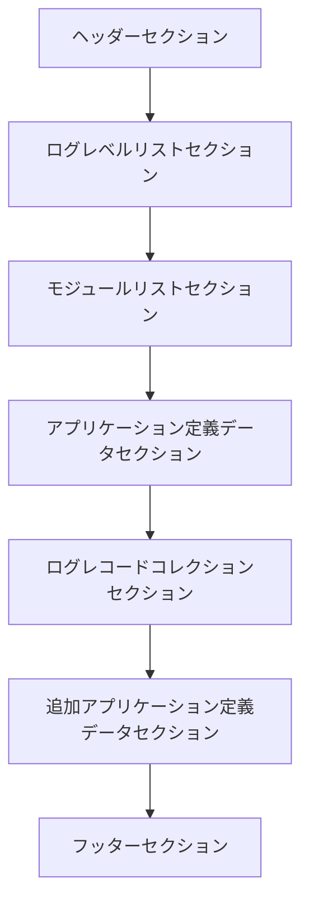

#  HSSoundBasisLibに搭載されるHSSBLoggerで利用されるログファイルフォーマット仕様書

## 目次

1. [目次](#目次)
2. [概要](#概要)
3. [コンセプト](#コンセプト)
   1. [コンセプト実現のための工夫事項](#コンセプト実現のための工夫事項)
4. [事前知識](#事前知識)
   1. [想定している利用環境などについて](#想定している利用環境などについて)
   2. [エンディアンについて](#エンディアンについて)
   3. [wchar\_t型について](#wchar_t型について)
   4. [SHA-256ハッシュ値について](#sha-256ハッシュ値について)
   5. [構造の表記方法について](#構造の表記方法について)
   6. [UUIDについて](#uuidについて)
   7. [可変長データにおけるサイズ指定について](#可変長データにおけるサイズ指定について)
   8. [各種識別子一覧](#各種識別子一覧)
   9. [構造体のアライメントについて](#構造体のアライメントについて)
5. [独自の型定義](#独自の型定義)
   1. [日時構造体 (HSSBLoggerDateTime)](#日時構造体-hssbloggerdatetime)
      1. [DateInMJD](#dateinmjd)
      2. [TimeInMilliseconds](#timeinmilliseconds)
      3. [Microseconds](#microseconds)
   2. [共通セクションヘッダー構造体](#共通セクションヘッダー構造体)
      1. [SectionID](#sectionid)
      2. [SectionSize](#sectionsize)
6. [ファイル構造](#ファイル構造)
   1. [全体構成イメージ](#全体構成イメージ)
   2. [ヘッダーセクション](#ヘッダーセクション)
      1. [FormatID](#formatid)
      2. [FormatVersionID](#formatversionid)
      3. [ImplementerID](#implementerid)
      4. [LoggerID](#loggerid)
      5. [ApplicationID](#applicationid)
      6. [ApplicationMajorVersion](#applicationmajorversion)
      7. [ApplicationMinorVersion](#applicationminorversion)
      8. [ProcessID](#processid)
      9. [CreationTimestamp](#creationtimestamp)
      10. [SectionOffsets ( HSSBLoggerFileHeaderOffsetCollection )にセットする各セクションのオフセットについて](#sectionoffsets--hssbloggerfileheaderoffsetcollection-にセットする各セクションのオフセットについて)
      11. [SectionOffsets.OffsetOfLogLevelListSection ( HSSBLoggerFileHeaderOffsetCollection::OffsetOfLogLevelListSection )](#sectionoffsetsoffsetofloglevellistsection--hssbloggerfileheaderoffsetcollectionoffsetofloglevellistsection-)
      12. [SectionOffsets.OffsetOfModuleListSection ( HSSBLoggerFileHeaderOffsetCollection::OffsetOfModuleListSection )](#sectionoffsetsoffsetofmodulelistsection--hssbloggerfileheaderoffsetcollectionoffsetofmodulelistsection-)
      13. [SectionOffsets.OffsetOfAppDefinedDataSection ( HSSBLoggerFileHeaderOffsetCollection::OffsetOfAppDefinedDataSection )](#sectionoffsetsoffsetofappdefineddatasection--hssbloggerfileheaderoffsetcollectionoffsetofappdefineddatasection-)
      14. [SectionOffsets.OffsetOfLogRecordCollectionSection ( HSSBLoggerFileHeaderOffsetCollection::OffsetOfLogRecordCollectionSection )](#sectionoffsetsoffsetoflogrecordcollectionsection--hssbloggerfileheaderoffsetcollectionoffsetoflogrecordcollectionsection-)
      15. [SectionOffsets.OffsetOfAddAppDefinedDataSection ( HSSBLoggerFileHeaderOffsetCollection::OffsetOfAddAppDefinedDataSection )](#sectionoffsetsoffsetofaddappdefineddatasection--hssbloggerfileheaderoffsetcollectionoffsetofaddappdefineddatasection-)
      16. [SectionOffsets.OffsetOfFooterSection ( HSSBLoggerFileHeaderOffsetCollection::OffsetOfFooterSection )](#sectionoffsetsoffsetoffootersection--hssbloggerfileheaderoffsetcollectionoffsetoffootersection-)
      17. [SectionOffsets.OffsetOfFunctionListSection ( HSSBLoggerFileHeaderOffsetCollection::OffsetOfFunctionListSection )](#sectionoffsetsoffsetoffunctionlistsection--hssbloggerfileheaderoffsetcollectionoffsetoffunctionlistsection-)
      18. [SectionSHA256Values.HeaderSHA256 ( HSSBLoggerFileHeaderSHA256Collection::HeaderSHA256 )](#sectionsha256valuesheadersha256--hssbloggerfileheadersha256collectionheadersha256-)
      19. [SectionSHA256Values.LogLevelListSectionSHA256 ( HSSBLoggerFileHeaderSHA256Collection::LogLevelListSectionSHA256 )](#sectionsha256valuesloglevellistsectionsha256--hssbloggerfileheadersha256collectionloglevellistsectionsha256-)
      20. [SectionSHA256Values.ModuleListSectionSHA256 ( HSSBLoggerFileHeaderSHA256Collection::ModuleListSectionSHA256 )](#sectionsha256valuesmodulelistsectionsha256--hssbloggerfileheadersha256collectionmodulelistsectionsha256-)
      21. [SectionSHA256Values.AppDefinedDataSectionSHA256 ( HSSBLoggerFileHeaderSHA256Collection::AppDefinedDataSectionSHA256 )](#sectionsha256valuesappdefineddatasectionsha256--hssbloggerfileheadersha256collectionappdefineddatasectionsha256-)
      22. [SectionSHA256Values.LogRecordCollectionSectionSHA256 ( HSSBLoggerFileHeaderSHA256Collection::LogRecordCollectionSectionSHA256 )](#sectionsha256valueslogrecordcollectionsectionsha256--hssbloggerfileheadersha256collectionlogrecordcollectionsectionsha256-)
      23. [SectionSHA256Values.AddAppDefinedDataSectionSHA256 ( HSSBLoggerFileHeaderSHA256Collection::AddAppDefinedDataSectionSHA256 )](#sectionsha256valuesaddappdefineddatasectionsha256--hssbloggerfileheadersha256collectionaddappdefineddatasectionsha256-)
      24. [SectionSHA256Values.FooterSectionSHA256 ( HSSBLoggerFileHeaderSHA256Collection::FooterSectionSHA256 )](#sectionsha256valuesfootersectionsha256--hssbloggerfileheadersha256collectionfootersectionsha256-)
      25. [SectionSHA256Values.FunctionListSectionSHA256 ( HSSBLoggerFileHeaderSHA256Collection::FunctionListSectionSHA256 )](#sectionsha256valuesfunctionlistsectionsha256--hssbloggerfileheadersha256collectionfunctionlistsectionsha256-)
      26. [Finalized.FileSize ( HSSBLoggerFileHeaderFinalizedWriteFields::FileSize )](#finalizedfilesize--hssbloggerfileheaderfinalizedwritefieldsfilesize-)
      27. [Finalized.FinalizedTimestamp ( HSSBLoggerFileHeaderFinalizedWriteFields::FinalizedTimestamp )](#finalizedfinalizedtimestamp--hssbloggerfileheaderfinalizedwritefieldsfinalizedtimestamp-)
      28. [Finalized.CountOfLogRecords ( HSSBLoggerFileHeaderFinalizedWriteFields::CountOfLogRecords )](#finalizedcountoflogrecords--hssbloggerfileheaderfinalizedwritefieldscountoflogrecords-)
   3. [ログレベルリストセクション](#ログレベルリストセクション)
      1. [CountOfLogLevels](#countofloglevels)
      2. [HSSBLoggerLogLevelListSectionEntry構造体](#hssbloggerloglevellistsectionentry構造体)
         1. [LevelID](#levelid)
         2. [EnableBackgroundColorForViewer](#enablebackgroundcolorforviewer)
         3. [EnableForegroundColorForViewer](#enableforegroundcolorforviewer)
         4. [BackgroundColorForViewer](#backgroundcolorforviewer)
         5. [ForegroundColorForViewer](#foregroundcolorforviewer)
         6. [ApplicationDefinedValue](#applicationdefinedvalue)
         7. [LevelNameLength](#levelnamelength)
         8. [LevelName](#levelname)
   4. [モジュールリストセクション](#モジュールリストセクション)
      1. [CountOfModules](#countofmodules)
      2. [ModuleListEntrys.ModuleID ( HSSBLoggerModuleListEntry::ModuleID )](#modulelistentrysmoduleid--hssbloggermodulelistentrymoduleid-)
      3. [ModuleListEntrys.ApplicationDefinedValue ( HSSBLoggerModuleListEntry::ApplicationDefinedValue )](#modulelistentrysapplicationdefinedvalue--hssbloggermodulelistentryapplicationdefinedvalue-)
      4. [ModuleListEntrys.ModuleNameLength ( HSSBLoggerModuleListEntry::ModuleNameLength )](#modulelistentrysmodulenamelength--hssbloggermodulelistentrymodulenamelength-)
      5. [ModuleListEntrys.ModuleName ( HSSBLoggerModuleListEntry::ModuleName )](#modulelistentrysmodulename--hssbloggermodulelistentrymodulename-)
   5. [アプリケーション定義データセクション](#アプリケーション定義データセクション)
      1. [DataLength](#datalength)
      2. [Data](#data)
   6. [関数名リストセクション](#関数名リストセクション)
      1. [CountOfFunctions](#countoffunctions)
      2. [FunctionListEntrys.FunctionID ( HSSBLoggerFunctionListEntry::FunctionID )](#functionlistentrysfunctionid--hssbloggerfunctionlistentryfunctionid-)
      3. [FunctionListEntrys.ApplicationDefinedValue ( HSSBLoggerFunctionListEntry::ApplicationDefinedValue )](#functionlistentrysapplicationdefinedvalue--hssbloggerfunctionlistentryapplicationdefinedvalue-)
      4. [FunctionListEntrys.FunctionNameLength ( HSSBLoggerFunctionListEntry::FunctionNameLength )](#functionlistentrysfunctionnamelength--hssbloggerfunctionlistentryfunctionnamelength-)
      5. [FunctionListEntrys.FunctionName ( HSSBLoggerFunctionListEntry::FunctionName )](#functionlistentrysfunctionname--hssbloggerfunctionlistentryfunctionname-)
   7. [ログレコードコレクションセクション](#ログレコードコレクションセクション)
      1. [HSSBLoggerLogRecordCollectionSectionHeader構造体](#hssbloggerlogrecordcollectionsectionheader構造体)
         1. [CountOfLogRecordCollections](#countoflogrecordcollections)
         2. [MaximumLogRecordsPerCollection](#maximumlogrecordspercollection)
      2. [HSSBLoggerLogRecordCollectionEntry構造体](#hssbloggerlogrecordcollectionentry構造体)
         1. [CountOfLogRecords](#countoflogrecords)
      3. [HSSBLoggerLogRecord構造体](#hssbloggerlogrecord構造体)
         1. [Timestamp](#timestamp)
         2. [EntryID](#entryid)
         3. [ThreadID](#threadid)
         4. [LogLevelID](#loglevelid)
         5. [ModuleID](#moduleid)
         6. [FunctionID](#functionid)
         7. [MessageLength](#messagelength)
         8. [AttachedDumpHeader](#attacheddumpheader)
         9. [AttachedCustomHeader](#attachedcustomheader)
         10. [Message](#message)
         11. [AttachedDumpData](#attacheddumpdata)
         12. [AttachedCustomData](#attachedcustomdata)
      4. [HSSBLoggerLogRecordAttachedDataHeader構造体](#hssbloggerlogrecordattacheddataheader構造体)
         1. [Length](#length)
         2. [TypeID](#typeid)
         3. [EncodeMode](#encodemode)
         4. [CRC32](#crc32)
         5. [OriginalLength](#originallength)
         6. [OriginalCRC32](#originalcrc32)
   8. [追加アプリケーション定義データセクション](#追加アプリケーション定義データセクション)
   9. [フッターセクション](#フッターセクション)
      1. [BeforeFileSize](#beforefilesize)
      2. [EndOfFileMarkerID](#endoffilemarkerid)
7. [Appendix](#appendix)
   1. [グレゴリオ暦と修正ユリウス日の変換について](#グレゴリオ暦と修正ユリウス日の変換について)
   2. [SYSTEMTIME構造体との変換関数実装例](#systemtime構造体との変換関数実装例)


## 概要

この仕様書は、HSSBLoggerが使用するオリジナルのログファイルフォーマットについて説明します。

## コンセプト

HSSBLoggerのログファイルフォーマットは、効率的なデータ保存と高速な読み取りを目的としており、<br>
設計のコンセプトとして、できるだけファイルサイズを小さくすることを目指しています。

### コンセプト実現のための工夫事項


* バイナリフォーマットの採用
  * テキスト形式ではなくバイナリ形式を採用することで、データの冗長性を排除し、ファイルサイズを削減しています。
* ログレベル名やモジュール名などの繰り返し使用される文字列は、別のセクションで一括管理し、ログレコード内ではID参照のみを行うことで、冗長なデータの保存を避けています
  *  将来、テキストファイルに変換する場合や、専用ビューワーを開発し表示する場合においても、この情報を参照することなく文字列に変換できます

* ログレコードはバイナリ形式で保存され、テキスト形式に比べてデータサイズを削減しています。


## 事前知識

### 想定している利用環境などについて

Windowsで利用されることを想定しております。  <br>
そのため、ログファイルフォーマットはリトルエンディアンで設計されています。<br>
また、本仕様書において記載される型はC++標準ライブラリに定義されているものに、<br>
加えて、Microsoft社によって定義されているものも含まれます。<br>

Microsoft社によって定義される型はMicrosoft社によって仕様が公開されております。<br>
該当仕様書へのリンク: [`[MS-DTYP]: Windows Data Types`](https://learn.microsoft.com/en-us/openspecs/windows_protocols/ms-dtyp/cca27429-5689-4a16-b2b4-9325d93e4ba2) 

そのため、それらで定義されている型についての説明は割愛します。<br>
ただし、記載した方が良いと判断したものについては説明を加えます。<br>

### エンディアンについて

本フォーマットでは、リトルエンディアンを採用しています。<br>
そのため、複数バイトで構成される型 (例: uint32_t型など) は、<br>
最下位バイトが先頭に配置され、最上位バイトが最後に配置されます。


```cpp
uint32_t exampleValue = 0x12345678;
```

例えば、上記のようなuint32_t型の値がある場合、<br>
ビッグエンディアンではメモリ上に『`12 34 56 78`』と配置されますが、<br>
リトルエンディアンでは『`78 56 34 12`』と配置されます。<br>
この仕様書においても、同様にリトルエンディアンでの配置を前提としています。<br>

> [!IMPORTANT]
> これは、Windows環境を想定しているためです。<br>
> Linux環境などで本フォーマットを扱う場合、エンディアンの変換が必要になる可能性があります。<br>
> その場合、適切にエンディアン変換を行ってください。
> また、ファイルを生成する際には、リトルエンディアンで保存するように注意してください。


### wchar_t型について

* 本フォーマットではWindows環境を想定しているため、`wchar_t`型は2バイトのUTF-16LEエンコードとして扱います
  - NULL終端される文字列は、2バイトの0x0000で終端されます
  - そのため、`wchar_t`型の配列のサイズは必ず偶数バイトとなります 

* 本フォーマットのファイルをLinux環境などで扱う場合、`wchar_t`型のサイズが異なる可能性があるため、注意してください
  - 例えば、uint16_t型やchar16_t型として扱うなど工夫をお願いいたします
  
* なお、char16_t型ではなく`wchar_t`型を採用している理由は、Windows APIとの互換性を考慮してのことです


* char型ではなく`wchar_t`型を採用している理由は、互換性と日本語対応を容易にするためです
  - Visual Studioの環境では、設定によってchar型の文字コードが変化します
    - 例えば、Shift-JISやUTF-8などが考えられます
    - そのため、char型を使用すると、環境によって文字列の解釈が変わる可能性があります
  - 一方、UTF-16LEエンコードの`wchar_t`型を使用することで、
    - 文字列の解釈が一貫し、日本語などのマルチバイト文字も正しく扱うことができます (文字化けを防止できます)

### SHA-256ハッシュ値について

* SHA-256ハッシュ値の計算には例えば以下の方法を選択できます
  - [FIPS 180-4 Secure Hash Standard (SHS)](https://csrc.nist.gov/pubs/fips/180-4/upd1/final)の仕様を参考に独自で実装する
  - [Windows Cryptography API: Next Generation (CNG)](https://learn.microsoft.com/ja-jp/windows/win32/seccng/cng-portal)を使用する
  - その他の信頼できるサードパーティ製のライブラリを使用する

### 構造の表記方法について

以下のようにC++の構造体風に表記します。説明のため、C++コードとして直接利用できない表記を含むことがあります。
(以下は、例示のためchar型を使用しています)


```cpp
struct SampleStruct {
    uint32_t   member1;    // 4バイトの符号なし整数
    float      member2;    // 4バイトの浮動小数点数
    char       member3[8]; // 8バイトの文字配列
};
```

以下、C++でそのまま利用できない例となります

```cpp
struct AnotherStruct {
    uint8_t    memberCSize;       // 1バイトの符号なし整数（memberCのサイズを示す）
    double     memberB;           // 8バイトの浮動小数点数
    uint8_t    memberC[memberCSize];  // memberCSizeバイトの可変長配列
};
```

### UUIDについて

本フォーマットでは識別子としてUUIDを利用することがあります。<br>
UUIDはWindows SDK上では、GUIDと同じであり、<br>Visual Studioの付属ツール(`guidgen.exe`)や、<br>
[Win32 APIのUuidCreate 関数](https://learn.microsoft.com/ja-jp/windows/win32/api/rpcdce/nf-rpcdce-uuidcreate)を使用するなどで生成可能です。


### 可変長データにおけるサイズ指定について

本フォーマットでは、可変長データを扱う場合、<br>

* 可変長データの直前に、そのサイズを示すフィールドを設けることとします

* サイズの単位はバイト固定とします
 - wchar_t型の文字列の場合はサイズはバイト数で示します
    - このバイト数には、NULL終端の2バイトも含まれます
    - 例えば、`L"Test"`という文字列の場合、サイズは6バイトとなります (4文字分の8バイト + NULL終端の2バイト)  

> [!TIP]
> 文字列を含めて、バイト固定にしたのは、場所により単位が変わり、混乱を避けるためです。

### 各種識別子一覧

|識別子名|タイプ|概要|値|
|---|---|---|---|
|FormatID|UUID|ログファイルフォーマットの識別子|`{2E65D3B6-A54A-4914-92CF-AD3607939B5B}`|
|FormatVersionID|UUID|ログファイルフォーマットのバージョン識別子|`{6098C04B-6845-436B-BACC-371B5C8496B7}`|
|ImplementerID|UUID|ロガーの実装者識別子<br>なお、仕様設計者として値列のUUID値を予約させていただきます|`{D21001BF-19FF-45DB-BB2C-2EA65B12A335}`|
|LoggerID|UUID|ログファイルを生成したロガー実装の識別子<br>なお、HSSBLogger用に値列のUUID値を予約させていただきます|`{A8978E8E-51AA-452C-9A5E-22AF9D543F54}`|
|ApplicationID|UUID|ログファイルを生成したアプリケーションの識別子<br>ロガーを利用したアプリケーション定義のため値は未定義となります|`(未定義)`|
|EndOfFileMarkerID|UUID|ファイル終端マーカ識別子|`{1B3FD874-CBCC-4385-95D8-615A8D170AC8}`|
|LogLevelSectionID|uint64_t|ログレベルセクション識別子であり、`SECLOGLV`を示す|0x564c474f4c434553|
|ModuleListSectionID|uint64_t|モジュールリストセクション識別子であり、`SECMODL`を示す|0x004c444f4d434553|
|AppDefinedSectionID|uint64_t|アプリケーション定義データセクション識別子であり、`SECAPPD`を示す|0x0044505041434553|
|LogRecordCollectionSectionID|uint64_t|ログレコードコレクションセクション識別子であり、`SECLRCS`を示す|0x005343524c434553|
|LogRecordCollectionEntryID|uint64_t|ログレコードコレクションエントリ識別子であり、`SECLRCE`を示す|0x004543524c434553|
|LogRecordHeaderID|uint64_t|ログレコードヘッダー識別子であり、`SECLRH`を示す|0x000048524c434553|
|AddAppDefinedSectionID|uint64_t|追加アプリケーション定義データセクション識別子であり、`SECAPPD2`を示す|0x3244505041434553|
|FooterSectionID|uint64_t|フッターセクション識別子であり、`SECFOTER`を示す|0x5245544f46434553|
|FunctionListSectionID|uint64_t|関数名リストセクション識別子であり、`SECFUNCS`を示す|0x53434e5546434553|

* UUIDの識別子をコード内で利用する場合は、以下のように定義します

  ```cpp
  // ログファイルフォーマット識別子 (FormatID)
  // レジストリ形式：{2E65D3B6-A54A-4914-92CF-AD3607939B5B}
  static const UUID FormatID = { 0x2e65d3b6, 0xa54a, 0x4914, { 0x92, 0xcf, 0xad, 0x36, 0x7, 0x93, 0x9b, 0x5b } };

  // ログファイルフォーマットバージョン識別子 (FormatVersionID)
  // {6098C04B-6845-436B-BACC-371B5C8496B7}
  static const UUID FormatVersionID = { 0x6098c04b, 0x6845, 0x436b, { 0xba, 0xcc, 0x37, 0x1b, 0x5c, 0x84, 0x96, 0xb7 } };

  // ロガー実装者識別子 (ImplementerID)
  // 仕様設計者として以下の値を予約させていただきます
  // {D21001BF-19FF-45DB-BB2C-2EA65B12A335}
  static const UUID ImplementerID = { 0xd21001bf, 0x19ff, 0x45db, { 0xbb, 0x2c, 0x2e, 0xa6, 0x5b, 0x12, 0xa3, 0x35 } };


  // EOFマーカー識別子 (EndOfFileMarkerID)
  // {1B3FD874-CBCC-4385-95D8-615A8D170AC8}
  static const GUID EndOfFileMarkerID = { 0x1b3fd874, 0xcbcc, 0x4385, { 0x95, 0xd8, 0x61, 0x5a, 0x8d, 0x17, 0xa, 0xc8 } };

  // ロガー実装識別子 (LoggerID)
  // HSSBLogger用に以下の値を予約させていただきます
  // {A8978E8E-51AA-452C-9A5E-22AF9D543F54}
  static const GUID LoggerID = { 0xa8978e8e, 0x51aa, 0x452c, { 0x9a, 0x5e, 0x22, 0xaf, 0x9d, 0x54, 0x3f, 0x54 } };
  ```

* 各セクションIDの値について
  - 各セクションIDは、セクション名をASCIIコードで表現したものをリトルエンディアンで解釈した値となっています
  - 例えば、ログレベルセクション識別子である`SECLOGLV`は、以下のように変換されます
    - 各文字をASCIIコードで表すと次のようになります: `S(0x53) E(0x45) C(0x43) L(0x4C) O(0x4F) G(0x47) L(0x4C) V(0x56)`
    - ファイル上では、「`SECLOGLV`」として保存します  
    - ただし、本フォーマットでは、uint64_t整数として取り扱うため、『`0xXXXX`』として表記する場合、リトルエンディアンで解釈した値を使用します
      - これにより、各文字の順番が逆転し、`0x564c474f4c434553`となります
    - ModuleListSectionID (`SECMODL`)のように8文字に満たない場合、残りのバイトには0x00が補完されます
      - 例えば、`SECMODL`は`S(0x53) E(0x45) C(0x43) M(0x4D) O(0x4F) D(0x44) L(0x4C) (0x00)`となり、リトルエンディアンで解釈すると`0x004c444f4d434553`となります

### 構造体のアライメントについて

本フォーマットにおいて、各要素は1バイト単位で取り扱う必要があります。<br>
そのため、各構造体の定義時に、以下のように#pragma packディレクティブを使用して、<br>
構造体のアライメントを1バイトに設定してください。<br>

```cpp
#pragma pack( push,1 )

struct Sample1Struct {
    uint8_t   member1;    // 1バイトの符号なし整数
    uint32_t  member2;    // 4バイトの符号なし整数
    uint16_t  member3;    // 2バイトの符号なし整数
};

struct Sample2Struct {
    uint16_t  memberA;    // 2バイトの符号なし整数
    uint8_t   memberB;    // 1バイトの符号なし整数
    uint8_t   memberC;    // 1バイトの符号なし整数
};

#pragma pack( pop )
```


## 独自の型定義

ログファイルの構成にかかわる以外での独自の型をここに記載します。


### 日時構造体 (HSSBLoggerDateTime)

```cpp
struct HSSBLoggerDateTime {
    // グレゴリオ暦の修正ユリウス日 (MJD)
    // （1858年11月17日からの経過日数を示す符号なし32ビット整数)    
    uint32_t DateInMJD; 

    // 1日を基準とした経過ミリ秒数（0～86,399,999）
    uint32_t TimeInMilliseconds; 

    // ミリ秒未満のマイクロ秒部分 (0～999)
    uint32_t Microseconds;
};
```


#### DateInMJD

`DateInMJD`は、グレゴリオ暦に基づく修正ユリウス日(MJD: Modified Julian Date)を示す符号なし32ビット整数です。<br>
この値は1858年11月17日を基準日としており、その日からの経過日数を表します。<br><br>
例えば、2025年12月19日は61028に対応します。<br>

なお、本仕様において、上限は特に規定致しませんが、SYSTEMTIME構造体の表現範囲に基づき、<br>
10,580,754 (30827年12月31日)以下であることを推奨します。<br>
(現在2025年であるため、十分に先の未来までカバーできると考えられます)

#### TimeInMilliseconds

`TimeInMilliseconds`は、1日を基準とした経過ミリ秒数を示す符号なし32ビット整数です。<br>
基点は0時0分0秒000であり、その時の値は0です。正午(12時0分0秒000)は43,200,000となります。<br>
最終的に23時59分59秒999(=86,399,999)までの値を取ることができます。<br>

#### Microseconds

`Microseconds`は、ミリ秒未満のマイクロ秒部分を示す符号なし32ビット整数です。<br>
この値は0から999までの範囲を取り、1ミリ秒未満の時間を表現します。<br>
アプリケーションの都合上必要な場合にセットしてください。<br>
不要な場合は0をセットしてください。<br>

> [!NOTE]
> TimeInMilliseconds*1000 + Microsecondsで、1日を基準とした経過マイクロ秒数を得ることができます。<br>
> ただし、1日のマイクロ秒数は86,400,000,000となり、32ビット整数に収まらない可能性があるため、<br>
> 必要に応じて64ビット整数型で計算してください。<br>
>
> あるいは、((TimeInMilliseconds % 1000) * 1000) + Microsecondsで、1秒を基準とした経過マイクロ秒数を得ることもできます。<br>
> こちらの場合、1秒あたり1,000,000となり、32ビット整数型で収まります。

### 共通セクションヘッダー構造体

この構造体は、各セクションの先頭に配置され、セクションの識別子とサイズを示します。<br>
なお、ヘッダーセクションはこの構造体を持ちません。


```cpp
struct HSSBLoggerCommonSectionHeader {
    uint64_t  SectionID;       // セクション識別子
    uint64_t  SectionSize;     // セクション全体のサイズ (バイト単位)
};
```

#### SectionID

`SectionID`は、セクションの識別子を示す符号なし64ビット整数です。<br>
各セクションごとに固有の識別子が割り当てられています。<br>

#### SectionSize

`SectionSize`は、HSSBLoggerCommonSectionHeaderより後のセクションデータ全体のサイズを示す符号なし64ビット整数です。<br>

> [!WARNING]
> HSSBLoggerCommonSectionHeader自体のサイズは含みません。

バイト単位で表されます。<br>

* 例
  - まず、以下のようなSampleSection構造体があるとします。

    ```cpp
    struct SampleSection {
        HSSBLoggerCommonSectionHeader Header; // 共通セクションヘッダー
        uint32_t                      Data1;  // 4バイトのデータ
        uint16_t                      Data2;  // 2バイトのデータ
        uint8_t                       Data3;  // 1バイトのデータ
    };
    ```
  - この場合、SectionSizeの値は、`4 + 2 + 1 = 7`となります。<br>
  - C++ではこの値を以下のように設定できます。

    ```cpp
    SampleSection sample;
    sample.Header.SectionSize = sizeof(SampleSection) - sizeof(HSSBLoggerCommonSectionHeader);
    ```
    - もし、この構造体の後に続くデータがある場合は、可変長となるデータ分も含めて該当するサイズを全て加算してください

## ファイル構造

### 全体構成イメージ


本フォーマットの基本形は以下の通りです。<br>




また、関数名リストセクションを挿入することもできます。各セクションの概要を以下に記します。それぞれの詳細については、後述の各セクションの説明を参照してください。<br>

* 基本セクションの概要

  |セクション名|必須/任意|ヘッダーにセットするオフセットのフィールド名|ヘッダーにセットするオフセットの0許容|概要|
  |---|---|---|---|---|
  |ヘッダーセクション|必須|(なし)|（オフセットなし）|ファイル全体のメタデータを含むセクション。フォーマット識別子、バージョン情報、作成日時などが含まれます。|
  |ログレベルリストセクション|必須|OffsetOfLogLevelListSection|許容しない|ログレベル名とその識別子を管理するセクション。|
  |モジュールリストセクション|必須|OffsetOfModuleListSection|許容しない|ログを生成したモジュール名とその識別子を管理するセクション。|
  |アプリケーション定義データセクション|任意|OffsetOfAppDefinedDataSection|許容する|アプリケーション固有のデータを格納するセクション。|
  |ログレコードコレクションセクション|必須|OffsetOfLogRecordCollectionSection|許容しない|ログレコードコレクション(*)を1つ以上格納するセクション。|
  |追加アプリケーション定義データセクション|任意|OffsetOfAddAppDefinedDataSection|許容する|アプリケーション固有の追加データを格納するセクション。|
  |フッターセクション|必須|OffsetOfFooterSection|許容しない|ファイルの整合性を確認するための情報を含むセクション。|
  - ログレコードコレクション(*)
    - ログレコードを複数格納するセクションであり、各ログレコードはタイムスタンプ、ログレベル識別子、モジュール識別子、メッセージなどの情報を含みます

* 追加のセクションの概要 (すべて任意、ヘッダーにセットするオフセットは0に設定可能)

  |セクション名|概要|
  |---|---|
  |関数名リストセクション|ログレコードで使用される関数名とその識別子を管理するセクション。|

* ヘッダーにヘッダーを除くセクションのオフセットを格納する場所があり、フッター以外の配置位置は任意です
  - ただし、設計段階においては以下を想定しております
    - 先に記載したフローチャートの順番でセクションを配置する
    - 関数名リストセクションを配置する場合はログレコードセクションの前から後に配置する
  - フッターセクションは最後に配置するためフッターセクションと名付けたため最後に配置してください

### ヘッダーセクション


ヘッダーセクションは、ファイルの先頭に位置し、以下のように定義されます。
また、動的に更新する箇所があるため、ロガー内部に値を保存しておくことを推奨します。
(ロガー内部に保存しておくと、更新時にファイルから読み込むを避けられます)

```cpp
struct HSSBLoggerFileHeader {    
    // 以下ファイル生成と同時に設定されるフィールド
    UUID                  FormatID;                        // フォーマット識別子
    UUID                  FormatVersionID;                 // フォーマットバージョン識別子
    UUID                  ImplementerID;                   // 実装者識別子
    UUID                  LoggerID;                        // ロガー実装識別子
    UUID                  ApplicationID;                   // アプリケーション識別子
    uint16_t              ApplicationMajorVersion;         // アプリケーションメジャーバージョン
    uint16_t              ApplicationMinorVersion;         // アプリケーションマイナーバージョン
    DWORD                 ProcessID;                       // プロセスID
    HSSBLoggerDateTime    CreationTimestamp;               // ファイル作成タイムスタンプ (UTC)

    // 以下、動的に更新されるフィールド
    HSSBLoggerFileHeaderOffsetCollection SectionOffsets;   // 各セクションのファイル内オフセット集合
    HSSBLoggerFileHeaderSHA256Collection SectionSHA256Values; // 各セクションのSHA-256ハッシュ値集合

    // 以下ファイル書き込み完了時に設定されるフィールド
    HSSBLoggerFileHeaderFinalizedWriteFields Finalized;
};


// 以上で利用している構造体の定義は以下の通りです

// ファイル書き込み完了時に設定されるフィールド構造体
// ファイル作成時はすべて、0で初期化されます
struct HSSBLoggerFileHeaderFinalizedWriteFields{
    // 最終的なファイルサイズ (バイト単位)
    uint64_t              FileSize;                     // 最終的なファイルサイズ (バイト単位)
    
    // ファイル書き込み完了タイムスタンプ (UTC)
    HSSBLoggerDateTime    FinalizedTimestamp;

    // 各セクション内のエントリ数
    uint32_t              CountOfLogRecords;            // 最終的なログレコード数             
};


struct HSSBLoggerFileHeaderOffsetCollection {
    uint64_t  OffsetOfLogLevelListSection;          // ログレベルリストセクションのファイル内オフセット
    uint64_t  OffsetOfModuleListSection;            // モジュールリストセクションのファイル内オフセット
    uint64_t  OffsetOfAppDefinedDataSection;        // アプリケーション定義データセクションのファイル内オフセット
    uint64_t  OffsetOfLogRecordCollectionSection;   // ログレコードコレクションセクションのファイル内オフセット
    uint64_t  OffsetOfAddAppDefinedDataSection;     // 追加アプリケーション定義データセクションのファイル内オフセット
    uint64_t  OffsetOfFooterSection;                // フッターセクションのファイル内オフセット
    uint64_t  OffsetOfFunctionListSection;          // 関数名リストセクションのファイル内オフセット
};

struct HSSBLoggerSHA256Value {
    uint8_t  Hash[32];  // SHA-256ハッシュ値 (32バイト)
};


struct HSSBLoggerFileHeaderSHA256Collection {
  HSSBLoggerSHA256Value HeaderSHA256;          // ヘッダーセクションのSHA-256ハッシュ値
  HSSBLoggerSHA256Value LogLevelListSectionSHA256; // ログレベルリストセクションのSHA-256ハッシュ値
  HSSBLoggerSHA256Value ModuleListSectionSHA256;   // モジュールリストセクションのSHA-256ハッシュ値
  HSSBLoggerSHA256Value AppDefinedDataSectionSHA256; // アプリケーション定義データセクションのSHA-256ハッシュ値
  HSSBLoggerSHA256Value LogRecordCollectionSectionSHA256; // ログレコードコレクションセクションのSHA-256ハッシュ値
  HSSBLoggerSHA256Value AddAppDefinedDataSectionSHA256; // 追加アプリケーション定義データセクションのSHA-256ハッシュ値
  HSSBLoggerSHA256Value FooterSectionSHA256;        // フッターセクションのSHA-256ハッシュ値
  HSSBLoggerSHA256Value FunctionListSectionSHA256;  // 関数名リストセクションのSHA-256ハッシュ値
};


```

#### FormatID

* `FormatID`は、ログファイルフォーマットの識別子を示すUUIDです。<br>
この識別子は、ログファイルがHSSBLoggerの定義するフォーマットに準拠していることを示します。<br>
* 値: `{2E65D3B6-A54A-4914-92CF-AD3607939B5B}`

#### FormatVersionID

* `FormatVersionID`は、ログファイルフォーマットのバージョン識別子を示すUUIDです。<br>
* 値: `{6098C04B-6845-436B-BACC-371B5C8496B7}`

#### ImplementerID

* `ImplementerID`は、ロガーの実装者識別子を示すUUIDです。<br>
* 仕様設計者としての値: `{D21001BF-19FF-45DB-BB2C-2EA65B12A335}`

#### LoggerID


* `LoggerID`は、ログファイルを生成したロガー実装の識別子を示すUUIDです。<br>
* HSSBLogger用に予約された値: `{A8978E8E-51AA-452C-9A5E-22AF9D543F54}`

#### ApplicationID

* `ApplicationID`は、ログファイルを生成したアプリケーションの識別子を示すUUIDです。<br>
* ロガーを利用したアプリケーション定義のため値は未定義となります

#### ApplicationMajorVersion

* `ApplicationMajorVersion`は、ログファイルを生成したアプリケーションのメジャーバージョンを示す符号なし16ビット整数です。<br>

#### ApplicationMinorVersion

* `ApplicationMinorVersion`は、ログファイルを生成したアプリケーションのマイナーバージョンを示す符号なし16ビット整数です。<br>

#### ProcessID

* `ProcessID`は、ログファイルを生成したプロセスのプロセスIDを示す符号なし32ビット整数です。<br>
* Windows環境におけるプロセスIDを使用します
  - この値は[GetCurrentProcessId関数](https://learn.microsoft.com/ja-jp/windows/win32/api/processthreadsapi/nf-processthreadsapi-getcurrentprocessid)で取得可能です 


#### CreationTimestamp

* `CreationTimestamp`は、ログファイルの作成日時を示すHSSBLoggerDateTime構造体です。<br>
* 環境依存を防ぐため、UTC(協定世界時)で記録してください

#### SectionOffsets ( HSSBLoggerFileHeaderOffsetCollection )にセットする各セクションのオフセットについて

* セットする値は、『`sizeof(HSSBLoggerFileHeader)`』より大きい値である必要があります

  > [!IMPORTANT]
  > これは、ヘッダーの後にその他のセクションが続くためです。<br>

  > [!WARNING]
  > 必須となっているセクションについては、0のままにしないでください。<br>
  > なお、任意セクションについては、存在しない場合は0のままで構いません。<br>


  > [!NOTE]
  > これにより、必須セクションのオフセットが0である場合、ファイルが不正であることを検出できます。<br>

#### SectionOffsets.OffsetOfLogLevelListSection ( HSSBLoggerFileHeaderOffsetCollection::OffsetOfLogLevelListSection )

* `OffsetOfLogLevelListSection`は、ログレベルリストセクションのファイル内オフセットを示す符号なし64ビット整数です。<br>
  - ファイル先頭からのバイト単位でのオフセットを示します
  - ファイル作成時は0で初期化し、OffsetOfLogLevelListSectionの書き込み時にこの値をセットしてください
  - ログレベルリストセクションは必須であるため、0のままにしないでください
  - また、セットする値は、『`sizeof(HSSBLoggerFileHeader)`』より大きい値である必要があります

#### SectionOffsets.OffsetOfModuleListSection ( HSSBLoggerFileHeaderOffsetCollection::OffsetOfModuleListSection )

* `OffsetOfModuleListSection`は、モジュールリストセクションのファイル内オフセットを示す符号なし64ビット整数です。<br>
  - ファイル先頭からのバイト単位でのオフセットを示します
  - ファイル作成時は0で初期化し、OffsetOfModuleListSectionの書き込み時にこの値をセットしてください
  - モジュールリストセクションは必須であるため、0のままにしないでください
  - また、セットする値は、『`sizeof(HSSBLoggerFileHeader)`』より大きい値である必要があります


#### SectionOffsets.OffsetOfAppDefinedDataSection ( HSSBLoggerFileHeaderOffsetCollection::OffsetOfAppDefinedDataSection )

* `OffsetOfAppDefinedDataSection`は、アプリケーション定義データセクションのファイル内オフセットを示す符号なし64ビット整数です。<br>
  - ファイル先頭からのバイト単位でのオフセットを示します
  - ファイル作成時は0で初期化し、OffsetOfAppDefinedDataSectionの書き込み時にこの値をセットしてください
  - アプリケーション定義データセクションが存在しない場合は0のままで構いません
  - また、セットする値は、『`sizeof(HSSBLoggerFileHeader)`』より大きい値である必要があります

#### SectionOffsets.OffsetOfLogRecordCollectionSection ( HSSBLoggerFileHeaderOffsetCollection::OffsetOfLogRecordCollectionSection )

* `OffsetOfLogRecordCollectionSection`は、ログレコードコレクションセクションのファイル内オフセットを示す符号なし64ビット整数です。<br>
  - ファイル先頭からのバイト単位でのオフセットを示します
  - ファイル作成時は0で初期化し、OffsetOfLogRecordCollectionSectionの書き込み時にこの値をセットしてください
  - ログレコードコレクションセクションは必須であるため、0のままにしないでください
  - また、セットする値は、『`sizeof(HSSBLoggerFileHeader)`』より大きい値である必要があります


#### SectionOffsets.OffsetOfAddAppDefinedDataSection ( HSSBLoggerFileHeaderOffsetCollection::OffsetOfAddAppDefinedDataSection )


* `OffsetOfAddAppDefinedDataSection`は、追加アプリケーション定義データセクションのファイル内オフセットを示す符号なし64ビット整数です。<br>
  - ファイル先頭からのバイト単位でのオフセットを示します
  - ファイル作成時は0で初期化し、OffsetOfAddAppDefinedDataSectionの書き込み時にこの値をセットしてください
  - 追加アプリケーション定義データセクションが存在しない場合は0のままで構いません
  - また、セットする値は、『`sizeof(HSSBLoggerFileHeader)`』より大きい値である必要があります

#### SectionOffsets.OffsetOfFooterSection ( HSSBLoggerFileHeaderOffsetCollection::OffsetOfFooterSection )

* `OffsetOfFooterSection`は、フッターセクションのファイル内オフセットを示す符号なし64ビット整数です。<br>
  - ファイル先頭からのバイト単位でのオフセットを示します
  - ファイル作成時は0で初期化し、OffsetOfFooterSectionの書き込み時にこの値をセットしてください
  - フッターセクションは必須であるため、0のままにしないでください
  - また、セットする値は、『`sizeof(HSSBLoggerFileHeader)`』より大きい値である必要があります

#### SectionOffsets.OffsetOfFunctionListSection ( HSSBLoggerFileHeaderOffsetCollection::OffsetOfFunctionListSection )

* `OffsetOfFunctionListSection`は、関数名リストセクションのファイル内オフセットを示す符号なし64ビット整数です。<br>
  - ファイル先頭からのバイト単位でのオフセットを示します
  - ファイル作成時は0で初期化し、OffsetOfFunctionListSectionの書き込み時にこの値をセットしてください
  - 関数名リストセクションが存在しない場合は0のままで構いません
  - また、セットする値は、『`sizeof(HSSBLoggerFileHeader)`』より大きい値である必要があります


#### SectionSHA256Values.HeaderSHA256 ( HSSBLoggerFileHeaderSHA256Collection::HeaderSHA256 )

* `HeaderSHA256`は、ヘッダーセクションのSHA-256ハッシュ値を示す32バイトの配列です。<br>
* 計算方法を以下のように定めます
  1. ファイル作成時、動的及び最終化フィールドを0で初期化したものをメッセージに使用してSHA-256ハッシュ値を計算し、暫定的に`HeaderSHA256`にセットします
  2. ファイルをクローズする直前に、本フィールド以外をメッセージに使用してSHA-256ハッシュ値を再計算し、最終的な`HeaderSHA256`にセットします
    - 本フィールドは計算に含めません

#### SectionSHA256Values.LogLevelListSectionSHA256 ( HSSBLoggerFileHeaderSHA256Collection::LogLevelListSectionSHA256 )

* `LogLevelListSectionSHA256`は、ログレベルリストセクションのSHA-256ハッシュ値を示す32バイトの配列です。<br>
* 書き込み時にヘッダーを含めて計算してセットしてください

#### SectionSHA256Values.ModuleListSectionSHA256 ( HSSBLoggerFileHeaderSHA256Collection::ModuleListSectionSHA256 )

* `ModuleListSectionSHA256`は、モジュールリストセクションのSHA-256ハッシュ値を示す32バイトの配列です。<br>
* 書き込み時にヘッダーを含めて計算してセットしてください

#### SectionSHA256Values.AppDefinedDataSectionSHA256 ( HSSBLoggerFileHeaderSHA256Collection::AppDefinedDataSectionSHA256 )

* `AppDefinedDataSectionSHA256`は、アプリケーション定義データセクションのSHA-256ハッシュ値を示す32バイトの配列です。<br>
* 書き込み時にヘッダーを含めて計算してセットしてください

#### SectionSHA256Values.LogRecordCollectionSectionSHA256 ( HSSBLoggerFileHeaderSHA256Collection::LogRecordCollectionSectionSHA256 )

* 計算方法はファイルの先頭側から順にハッシュするわけではなく少々複雑なため別記します (LogRecordCollectionSectionの説明に記載します)
  - ドキュメント内の整合性不備を避けるため、ここでは詳細を省略します

#### SectionSHA256Values.AddAppDefinedDataSectionSHA256 ( HSSBLoggerFileHeaderSHA256Collection::AddAppDefinedDataSectionSHA256 )

* `AddAppDefinedDataSectionSHA256`は、追加アプリケーション定義データセクションのSHA-256ハッシュ値を示す32バイトの配列です。<br>
* 書き込み時にヘッダーを含めて計算してセットしてください

#### SectionSHA256Values.FooterSectionSHA256 ( HSSBLoggerFileHeaderSHA256Collection::FooterSectionSHA256 )

* `FooterSectionSHA256`は、フッターセクションのSHA-256ハッシュ値を示す32バイトの配列です。<br>
* 書き込み時にヘッダーを含めて計算してセットしてください
* 
#### SectionSHA256Values.FunctionListSectionSHA256 ( HSSBLoggerFileHeaderSHA256Collection::FunctionListSectionSHA256 )

* `FunctionListSectionSHA256`は、関数名リストセクションのSHA-256ハッシュ値を示す32バイトの配列です。<br>
* 書き込み時にヘッダーを含めて計算してセットしてください


#### Finalized.FileSize ( HSSBLoggerFileHeaderFinalizedWriteFields::FileSize )

* `Finalized.FileSize`は、最終的なファイルサイズを示す符号なし64ビット整数です。<br>
* バイト単位で表されます
* ファイル書き込み完了時に設定されます
* ファイル作成時は0で初期化されます

#### Finalized.FinalizedTimestamp ( HSSBLoggerFileHeaderFinalizedWriteFields::FinalizedTimestamp )

* `Finalized.FinalizedTimestamp`は、ファイル書き込み完了日時を示すHSSBLoggerDateTime構造体です。<br>
* 環境依存を防ぐため、UTC(協定世界時)で記録してください
* ファイル書き込み完了時に設定されます
* ファイル作成時は0で初期化されます

#### Finalized.CountOfLogRecords ( HSSBLoggerFileHeaderFinalizedWriteFields::CountOfLogRecords )

* `Finalized.CountOfLogRecords`は、最終的なログレコード数を示す符号なし32ビット整数です。<br>
* ファイル書き込み完了時に設定されます
* ファイル作成時は0で初期化されます


### ログレベルリストセクション


ログレベルリストセクションは以下の、HSSBLoggerLogLevelListSectionHeader構造体1つと、<br>
複数のHSSBLoggerLogLevelListSectionEntry構造体で構成されます。


```CPP
struct HSSBLoggerLogLevelListSectionHeader{

    HSSBLoggerCommonSectionHeader Header;           // 共通セクションヘッダー
    uint8_t                       CountOfLogLevels; // ログレベル数
};

struct HSSBLoggerLogLevelListSectionEntry {
    // ログレベルID
    uint8_t     LevelID;

    // ビューワー向け色情報(背景色) 有効フラグ (0: 無効, それ以外は有効)
    uint8_t        EnableBackgroundColorForViewer; 

    // ビューワー向け色情報(前景色) 有効フラグ (0: 無効, それ以外は有効)
    uint8_t        EnableForegroundColorForViewer;

    // ビューワー向け色情報 (背景色)
    COLORREF    BackgroundColorForViewer;
    
    // ビューワー向け色情報 (前景色)
    COLORREF    ForegroundColorForViewer;

    // アプリケーション定義値 (未使用時は0)
    uint64_t    ApplicationDefinedValue;

    // ログレベル名のバイトサイズ (UTF-16LEエンコード)
    uint32_t    LevelNameLength; 
    
    // ログレベル名 (バイトサイズはLevelNameLength固定です、UTF-16LEエンコード)
    wchar_t     LevelName[];
};
```


#### CountOfLogLevels

* `CountOfLogLevels`は、ログレベル数を示す符号なし8ビット整数です。<br>

#### HSSBLoggerLogLevelListSectionEntry構造体

各`HSSBLoggerLogLevelListSectionEntry`構造体は、1つのログレベルを表します。<br>

##### LevelID

* `LevelID`は、ログレベルの識別子を示す符号なし8ビット整数です。<br>
* ログレベルごとに一意の値を割り当ててください
  - 値は0～255の範囲で一意のIDを割り当てることができます
  - 値が小さいものは重大度が低いものとして扱われます


* 値例
  - 例1 (一般的なログレベル名との対応)

    |一般的なログレベル名|LevelID|
    |------------------|-------|
    | TRACE           | 0     |
    | DEBUG           | 1     |
    | INFO            | 2     |
    | WARNING         | 3     |
    | ERROR           | 4     |
    | FATAL           | 5     |

  - 例2 (試験的な機能と本機能が混在しており、試験的な機能の方の重要度を低く取り扱う場合)


    |ログレベル名|LevelID|
    |------------------|-------|
    | EXPERIMENTAL_TRACE   | 0     |
    | EXPERIMENTAL_DEBUG   | 1     |
    | EXPERIMENTAL_INFO    | 2     |
    | EXPERIMENTAL_WARNING | 3     |
    | EXPERIMENTAL_ERROR   | 4     |
    | EXPERIMENTAL_FATAL   | 5     |
    | TRACE           | 10     |
    | DEBUG           | 11     |
    | INFO            | 12     |
    | WARNING         | 13     |
    | ERROR           | 14     |
    | FATAL           | 15     |


##### EnableBackgroundColorForViewer

* `EnableBackgroundColorForViewer`は、ビューワー向けの背景色情報が有効であるかを示す符号なし8ビット整数です。<br>
* 0の場合、`BackgroundColorForViewer`の値は無視されます
* 0以外の場合、`BackgroundColorForViewer`の値が有効であることを示します


##### EnableForegroundColorForViewer

* `EnableForegroundColorForViewer`は、ビューワー向けの前景色情報が有効であるかを示す符号なし8ビット整数です。<br>
* 0の場合、`ForegroundColorForViewer`の値は無視されます
* 0以外の場合、`ForegroundColorForViewer`の値が有効であることを示します

##### BackgroundColorForViewer

* `BackgroundColorForViewer`は、ビューワー向けの背景色情報を示すCOLORREF型です。<br>
* COLORREF型はWindows SDKで定義されている型であり、RGB値を格納します。<br>
* ビューワーがログレコードを表示する際に使用される背景色を指定します

##### ForegroundColorForViewer

* `ForegroundColorForViewer`は、ビューワー向けの前景色情報を示すCOLORREF型です。<br>
* COLORREF型はWindows SDKで定義されている型であり、RGB値を格納します。<br>
* ビューワーがログレコードを表示する際に使用される前景色を指定します

##### ApplicationDefinedValue

* `ApplicationDefinedValue`は、アプリケーション定義値を示す符号なし64ビット整数です。<br>
* アプリケーション固有の情報を格納するために使用できます
* 未使用時は0に設定してください

##### LevelNameLength

* `LevelNameLength`は、ログレベル名のバイトサイズを示す符号なし32ビット整数です。<br>
   >  [!WARNING]
   > LevelNameの要素数ではないので注意してください。<br>
   > なお、要素数は `LevelNameLength / sizeof(wchar_t)` で計算できます

* UTF-16LEエンコードで表現されたログレベル名のバイト数を指定します
* NULL終端を含めてください


##### LevelName

* `LevelName`は、ログレベル名を示す可変長のUTF-16LEエンコードされた文字列です。<br>
* `LevelNameLength`で指定されたバイトサイズに従って格納されます
* NULL終端を含めてください

* 例
  - "INFO"
  - "WARNING"
  - "ERROR"
  - "DEBUG"
  - "TRACE"
  - "FATAL"

* また、文字列データであるため、以下のように日本語化しても問題ありません
    - "情報"
    - "警告"
    - "エラー"
    - "デバッグ"
    - "トレース"
    - "致命的"


### モジュールリストセクション

```cpp
struct HSSBLoggerModuleListHeader{
  HSSBLoggerCommonSectionHeader Header;       // 共通セクションヘッダー
  uint16_t                      CountOfModules; // モジュール数
  HSSBLoggerModuleListEntry     ModuleEntries[];  // モジュールエントリ配列
};

struct HSSBLoggerModuleListEntry {
    // モジュールID
    uint16_t    ModuleID;

    // アプリケーション定義値 (未使用時は0)
    uint64_t    ApplicationDefinedValue;

    // モジュール名のバイトサイズ (UTF-16LEエンコード)
    uint32_t    ModuleNameLength; 
    
    // モジュール名 (バイトサイズはModuleNameLength固定です、UTF-16LEエンコード)
    wchar_t     ModuleName[];
};
```

#### CountOfModules

* `CountOfModules`は、モジュール数を示す符号なし16ビット整数です。<br>
* ログを生成したモジュールごとに1つのエントリが存在します
* モジュールとは、アプリケーション内の特定のコンポーネントやライブラリを指します
* 例えば、異なるクラスや名前空間ごとにモジュールを定義することができます

> [!NOTE]
> 値の範囲は0～65,535であり、すべてでも65,535個のモジュールを定義できます。<br>
> ただし、実際にはそれほど多くのモジュールを定義することは稀と考えておりますが、<br>
> 万が一超える場合は、お手数ですが別のログファイルに分割して保存することを検討してください。

#### ModuleListEntrys.ModuleID ( HSSBLoggerModuleListEntry::ModuleID )

* `ModuleID`は、モジュールの識別子を示す符号なし16ビット整数です。<br>
* モジュールごとに一意の値を割り当ててください
  - 値は0～65,535の範囲で一意のIDを割り当てることができます


#### ModuleListEntrys.ApplicationDefinedValue ( HSSBLoggerModuleListEntry::ApplicationDefinedValue )

* `ApplicationDefinedValue`は、アプリケーション定義値を示す符号なし64ビット整数です。<br>
* アプリケーション固有の情報を格納するために使用できます
* 未使用時は0に設定してください

#### ModuleListEntrys.ModuleNameLength ( HSSBLoggerModuleListEntry::ModuleNameLength )

* `ModuleNameLength`は、モジュール名のバイトサイズを示す符号なし32ビット整数です。<br>
  >  [!WARNING]
  > ModuleNameの要素数ではないので注意してください。<br>
  > なお、要素数は `ModuleNameLength / sizeof(wchar_t)` で計算できます

* UTF-16LEエンコードで表現されたモジュール名のバイト数を指定します
* NULL終端を含めてください


#### ModuleListEntrys.ModuleName ( HSSBLoggerModuleListEntry::ModuleName )

* `ModuleName`は、モジュール名を示す可変長のUTF-16LEエンコードされた文字列です。<br>
* `ModuleNameLength`で指定されたバイトサイズに従って格納されます
* NULL終端を含めてください


### アプリケーション定義データセクション


```cpp
struct HSSBLoggerAppDefinedDataSectionHeader {

  // 共通セクションヘッダー
  HSSBLoggerCommonSectionHeader Header;   

  // アプリケーション定義データ長 (バイト単位)
  uint32_t    DataLength;

  // アプリケーション定義データ (可変長配列)
  // 長さはDataLengthによって決定されます
  uint8_t     Data[]; 
};
```


#### DataLength

* `DataLength`は、アプリケーション定義データのバイト長を示す符号なし32ビット整数です。<br>
* アプリケーション定義データのバイト数を指定します
* データが存在しない場合は0に設定してください

#### Data

* `Data`は、アプリケーション定義データを示す可変長のバイト配列です。<br>
* `DataLength`で指定されたバイトサイズに従って格納されます
* アプリケーション固有のデータを格納するために使用できます
* データの内容と形式はアプリケーションによって定義されます
* データが存在しない場合は、この配列は空になり、本要素は存在しません

### 関数名リストセクション

```cpp
struct HSSBLoggerFunctionListSectionHeader{
  HSSBLoggerCommonSectionHeader Header;       // 共通セクションヘッダー
  uint16_t                      CountOfFunctions; // 関数名数
  HSSBLoggerFunctionListEntry   FunctionEntries[];  // 関数名エントリ配列
};

struct HSSBLoggerFunctionListEntry {
    // 関数ID
    uint32_t    FunctionID;

    // アプリケーション定義値 (未使用時は0)
    uint64_t    ApplicationDefinedValue;

    // 関数名のバイトサイズ (UTF-16LEエンコード)
    uint32_t    FunctionNameLength; 
    
    // 関数名 (バイトサイズはFunctionNameLength固定です、UTF-16LEエンコード)
    wchar_t     FunctionName[];
};
```


#### CountOfFunctions

* `CountOfFunctions`は、関数名数を示す符号なし16ビット整数です。<br>
* ログを生成した関数ごとに1つのエントリが存在します
* 例えば、異なる関数ごとに関数名を定義することができます
* 値の範囲は0～65,535であり、すべてでも65,535個の関数名を定義できます。<br>


> [!NOTE]
> 先にモジュールリストセクションに定義したモジュールID一つに対して、1つのクラスに対応させた場合、同じ関数名であってもモジュールIDが異なれば別の関数名として扱うことができます。<br>
> 以下に例示します。
>
> * まず、以下のようにモジュールが定義されているものとします
>
>   |モジュールID|モジュール名|
>   |-------|---------|
>   | 1     | ModuleA |
>   | 2     | ModuleB |
>
> * 次に、以下のように関数リストが定義されているものとします
>
>   |関数ID|関数名      |
>   |-----|-----------|
>   | 1   | Initialize |
>   | 2   | Execute    |
>
> * このとき、モジュールIDと関数IDの組み合わせで以下のように解釈できます
>
>   |モジュールID|関数ID|解釈                  |
>   |-------|-----|---------------------|
>   | 1     | 1   | ModuleA::Initialize |
>   | 1     | 2   | ModuleA::Execute    |
>   | 2     | 1   | ModuleB::Initialize|
>   | 2     | 2   | ModuleB::Execute|


#### FunctionListEntrys.FunctionID ( HSSBLoggerFunctionListEntry::FunctionID )

* `FunctionID`は、関数名の識別子を示す符号なし32ビット整数です。<br>
* 関数名ごとに一意の値を割り当ててください
  - 値は0～4,294,967,295の範囲で一意のIDを割り当てることができます

#### FunctionListEntrys.ApplicationDefinedValue ( HSSBLoggerFunctionListEntry::ApplicationDefinedValue )

* `ApplicationDefinedValue`は、アプリケーション定義値を示す符号なし64ビット整数です。<br>
* アプリケーション固有の情報を格納するために使用できます
* 未使用時は0に設定してください
#### FunctionListEntrys.FunctionNameLength ( HSSBLoggerFunctionListEntry::FunctionNameLength )  

* `FunctionNameLength`は、関数名のバイトサイズを示す符号なし32ビット整数です。<br>
  >  [!WARNING]
  > FunctionNameの要素数ではないので注意してください。<br>
  > なお、要素数は `FunctionNameLength / sizeof(wchar_t)` で計算できます

* UTF-16LEエンコードで表現された関数名のバイト数を指定します
* NULL終端を含めてください

#### FunctionListEntrys.FunctionName ( HSSBLoggerFunctionListEntry::FunctionName )

* `FunctionName`は、関数名を示す可変長のUTF-16LEエンコードされた文字列です。<br>
* `FunctionNameLength`で指定されたバイトサイズに従って格納されます
* NULL終端を含めてください


### ログレコードコレクションセクション


```cpp

struct HSSBLoggerLogRecordCollectionSectionHeader {

  /*
    ここから固定フィールド
  */

  // 共通セクションヘッダー
  HSSBLoggerCommonSectionHeader Header;   

  // ログレコードコレクション数
  uint32_t    CountOfLogRecordCollections;

  // 1つのログレコードコレクションあたりの最大ログレコード数
  uint32_t   MaximumLogRecordsPerCollection;

  /*
    ここから可変長フィールド
  */

  // ログレコードコレクションエントリ配列 (可変長配列)
  // 長さはCountOfLogRecordCollectionsによって決定されます
  HSSBLoggerLogRecordCollectionEntry LogRecordCollections[];

};

struct HSSBLoggerLogRecordCollectionEntry {


  /*
    ここから固定フィールド
  */

  // 共通セクションヘッダー
  HSSBLoggerCommonSectionHeader Header;
  
  // ログレコード数
  uint32_t    CountOfLogRecords;

  // ログレコード配列 (可変長配列)
  // 長さはCountOfLogRecordsによって決定されます
  HSSBLoggerLogRecord LogRecords[];

};


struct HSSBLoggerLogRecord {

    /*
      ここから固定フィールド
    */
    HSSBLoggerCommonSectionHeader Header;                       // 共通セクションヘッダー
    HSSBLoggerDateTime    Timestamp;                            // タイムスタンプ (UTC)
    uint32_t    EntryID;                                        // エントリID (連番)
    uint32_t    ThreadID;                                       // スレッドID
    uint8_t     LogLevelID;                                     // ログレベルID
    uint16_t    ModuleID;                                       // モジュールID
    uint32_t    FunctionID;                                     // 関数ID
    uint32_t    MessageLength;                                  // メッセージ長 (バイト単位)
    HSSBLoggerLogRecordAttachedDataHeader AttachedDumpHeader;    // ダンプデータヘッダ
    HSSBLoggerLogRecordAttachedDataHeader AttachedCustomHeader;  // カスタムデータヘッダ
     
    //上の固定メンバーの後に続く可変長データ (※ ここままではC++の構造体としては不正です、説明用に記載しています)
  
    wchar_t     Message[];                                    // ログメッセージ  (バイト単位の長さはMessageLength、UTF-16LEエンコード、NUL文字終端)          
    uint8_t     AttachedDumpData[];                           // ダンプデータ    (長さはDump.Length、バイナリデータ)
    uint8_t     AttachedCustomData[];                         // カスタムデータ  (長さはCustom.Length、バイナリデータ)

};

// ログレコード付加データヘッダー
struct HSSBLoggerLogRecordAttachedDataHeader {
  /*
    ここから固定フィールド
  */
  uint32_t    Length;               // 子データ長 (バイト単位、0の場合は子データ無し)
  uint8_t     TypeID;               // 子データタイプID (0の場合は子データ無し、それ以外はアプリケーション定義)
  uint8_t     EncodeMode;           // 子データエンコードモード (生データは0に固定、それ以外は未定義)
  uint32_t    CRC32;                // 子データのCRC32値　(子データ無しの場合は0）
  uint32_t    OriginalLength;       // 子データ元サイズ (エンコードされている場合の元のサイズ、未エンコードの場合はLengthと同じ)
  uint32_t    OriginalCRC32;        // 子データの元データにおけるCRC32値　(エンコードされている場合の元のCRC32値、未エンコードの場合はCRC32と同じ)
};
```


> [!WARNING]
> HSSBLoggerLogRecordに続く可変長データは、Messaege、AttachedDumpData、AttachedCustomDataの順に格納してください。<br>
> また、各データの長さはそれぞれMessageLength、AttachedDumpHeader.Length、AttachedCustomHeader.Lengthで指定された長さに従って格納してください。

> [!NOTE]
>  HSSBLoggerLogRecordCollectionはビューワー側でのシーク性を確保するために導入しました。

> [!IMPORTANT]
> ヘッダーに記載するSHA-256ハッシュ値の計算方法は以下の通りです
>
> **なお、ファイルの先頭側から順にハッシュするわけではなく、以下に記載した順番に連結したものになりますので注意してください。**
> 
> * 以下の順番で連結したものをSHA-256ハッシュ値の計算に使用します 
>   1. HSSBLoggerLogRecord(AttachedDumpData、AttachedCustomData以外) を書き込み順(先頭側から)にメッセージに追加
>     - AttachedDumpData、AttachedCustomDataはCRC32で整合性を検出できるため除外します
>   2. HSSBLoggerLogRecordCollectionEntry(固定長フィールドのみ)を書き込み順(先頭側から)にメッセージに追加
>   3. HSSBLoggerLogRecordCollectionSectionHeader(固定長フィールドのみ)をメッセージに追加
>   4. 以上で構築されたメッセージを使用してSHA-256ハッシュ値を計算し、LogRecordCollectionSectionSHA256フィールドにセットします
> 
> この方法により、実装誤差を防ぎ、一貫したハッシュ値の計算が可能となります。
> また、後で再計算を行い、ログファイルの整合性を検証する際にも役立ちます。

#### HSSBLoggerLogRecordCollectionSectionHeader構造体

##### CountOfLogRecordCollections

* `CountOfLogRecordCollections`は、ログレコードコレクション数を示す符号なし32ビット整数です。<br>
* ログレコードコレクションセクション内に存在するログレコードコレクションの数を指定します
* ログレコードコレクションは、複数のログレコードをまとめて格納するための単位です


##### MaximumLogRecordsPerCollection

* `MaximumLogRecordsPerCollection`は、1つのログレコードコレクションあたりの最大ログレコード数を示す符号なし32ビット整数です。<br>
* 各ログレコードコレクションが格納できる最大のログレコード数を指定します
* 例えば、この値が1000に設定されている場合、各ログレコードコレクションは最大で1000個のログレコードを格納できます
* この値は、ログレコードの分割や管理に役立ちます
* ログレコード数が多い場合に、複数のコレクションに分割して格納することで、効率的なアクセスや処理が可能になります
* また、この値を適切に設定することで、メモリ使用量やパフォーマンスの最適化にも寄与します
* 例えば、非常に大きなログファイルを扱う場合に、適切なコレクションサイズを選択することで、読み込みや検索の効率が向上します
* この値は、アプリケーションの要件やログの特性に応じて調整することが推奨されます


#### HSSBLoggerLogRecordCollectionEntry構造体

##### CountOfLogRecords

* `CountOfLogRecords`は、ログレコード数を示す符号なし32ビット整数です。<br>
* ログレコードコレクション内に存在するログレコードの数を指定します

* ログレコードコレクションは、複数のログレコードをまとめて格納するための単位であり、<br>
* この値は、そのコレクション内に含まれるログレコードの数を示します
* 例えば、この値が500に設定されている場合、そのログレコードコレクションには500個のログレコードが格納されていることを意味します
* この値は、ログレコードの管理やアクセスに役立ちます
  
> [!WARNING]
> この値は、`MaximumLogRecordsPerCollection`で指定された最大ログレコード数を超えないようにしてください。<br>
> 例えば、`MaximumLogRecordsPerCollection`が1000に設定されている場合、`CountOfLogRecords`は1000以下である必要があります。

#### HSSBLoggerLogRecord構造体

##### Timestamp

* `Timestamp`は、ログレコードのタイムスタンプを示すHSSBLoggerDateTime構造体です。<br>
* 環境依存を防ぐため、UTC(協定世界時)で記録してください


##### EntryID

* `EntryID`は、ログレコードのエントリIDを示す符号なし32ビット整数です。<br>
* 各ログレコードに一意の連番を割り当ててください
  - ログレコードが生成されるたびに、前のログレコードのエントリIDに1を加えた値を割り当てます
  - 例えば、最初のログレコードには0、次のログレコードには1、その次には2というように連番を付与します

> [!WARNING]
> エントリIDはログファイル全体で一意である必要があります。<br>
> 例えば、複数のログレコードコレクションに分割されている場合でも、エントリIDは連続して割り当てられるようにしてください。
> 例えば、最初のコレクションの最後のログレコードがエントリID 999であった場合、次のコレクションの最初のログレコードはエントリID 1000となります。
> これにより、ログレコードの順序を正確に追跡できます。

##### ThreadID

* `ThreadID`は、ログレコードを生成したスレッドの識別子を示す符号なし32ビット整数です。<br>
* ログレコードが生成されたスレッドのIDを格納します
* これにより、マルチスレッド環境でのログ解析が容易になります
    - 例えば、特定のスレッドからのログのみを抽出したり、スレッドごとの動作を分析したりする際に役立ちます
* ここにセットする値は[GetCurrentThreadId 関数](https://learn.microsoft.com/ja-jp/windows/win32/api/processthreadsapi/nf-processthreadsapi-getcurrentthreadid)で取得可能です 

##### LogLevelID

* `LogLevelID`は、ログレコードのログレベル識別子を示す符号なし8ビット整数です。<br>
* ログレベルリストセクションで定義されたログレベルIDを使用してください
* これにより、ログレコードの重要度や種類を識別できます
* 例えば、DEBUG、INFO、WARNING、ERRORなどのログレベルを区別するために使用されます
* ログレベルに基づいてフィルタリングやソートを行う際に役立ちます
* また、ログ解析ツールがログレコードを適切に表示するためにも使用されます

##### ModuleID

* `ModuleID`は、ログレコードのモジュール識別子を示す符号なし16ビット整数です。<br>
* モジュールリストセクションで定義されたモジュールIDを使用してください
* これにより、ログレコードがどのモジュールから生成されたかを識別できます
* 例えば、アプリケーション内の異なるコンポーネントやライブラリごとにモジュールを定義し、ログレコードがどのモジュールに関連しているかを追跡できます
* ログ解析時に特定のモジュールからのログのみを抽出したり、モジュールごとの動作を分析したりする際に役立ちます
* また、モジュールごとのパフォーマンスやエラーの傾向を把握するためにも使用できます

##### FunctionID

* `FunctionID`は、ログレコードの関数識別子を示す符号なし32ビット整数です。<br>
* 関数名リストセクションで定義された関数IDを使用してください
  - もし、関数名リストセクションが存在しない場合は0を設定してください 
* これにより、ログレコードがどの関数から生成されたかを識別できます
* 例えば、アプリケーション内の異なる関数ごとに関数名を定義し、ログレコードがどの関数に関連しているかを追跡できます
* ログ解析時に特定の関数からのログのみを抽出したり、関数ごとの動作を分析したりする際に役立ちます
* また、関数ごとのパフォーマンスやエラーの傾向を把握するためにも使用できます

* 関数IDは、モジュールIDと組み合わせて使用することで、より詳細なログ解析が可能になります
  - 例えば、同じ関数名であっても異なるモジュールから呼び出された場合に区別することができます
  - これにより、アプリケーションの動作をより正確に把握できます
  - 例えば、モジュールIDが1で関数IDが100のログレコードと、モジュールIDが2で関数IDが100のログレコードを区別できます
  - これにより、同じ関数名であっても異なるモジュールからのログを正確に追跡できます

##### MessageLength

* `MessageLength`は、ログメッセージのバイト長を示す符号なし32ビット整数です。<br>
* ログメッセージはUTF-16LEエンコードされた文字列であり、NULL終端を含みます

> [!WARNING]
> MessageLengthは、文字列の要素数ではなくバイト数であることに注意してください。<br>
> 例えば、文字列が5文字であった場合、UTF-16LEエンコードでは1文字あたり2バイトであるため、MessageLengthは10バイトとなります。<br>
> また、NULL終端も含める必要があるため、実際の文字列が5文字であっても、MessageLengthは12バイトとなります。<br>
> つまり、`MessageLength = (文字列の文字数 + 1) * sizeof(wchar_t)` で計算されます。<br>
> ここで、`+1`はNULL終端を考慮しています。
>
> 例えば、"SampleString"という文字列の場合、文字数は12であり、NULL終端を含めると13文字となります。<br>
> したがって、MessageLengthは `(12 + 1) * 2 = 26` バイトとなります。

##### AttachedDumpHeader

* `AttachedDumpHeader`は、ログレコードに付加されるダンプデータのヘッダー情報を示すHSSBLoggerLogRecordAttachedDataHeader構造体です。<br>
* ダンプデータが存在しない場合は、Lengthフィールドを0に設定してください
* ダンプデータは、ログレコードに関連する追加のバイナリデータを格納するために使用されます
* 例えば、メモリダンプやスタックトレースなどの情報を格納することができます
* ダンプデータの内容と形式はアプリケーションによって定義されます
* ダンプデータが存在しない場合は、このヘッダーのLengthフィールドを0に設定し、他のフィールドは無視されます
* ダンプデータが存在する場合は、Lengthフィールドにダンプデータのバイト長を指定し、他のフィールドも適切に設定してください

##### AttachedCustomHeader

* `AttachedCustomHeader`は、ログレコードに付加されるカスタムデータのヘッダー情報を示すHSSBLoggerLogRecordAttachedDataHeader構造体です。<br>
* カスタムデータが存在しない場合は、Lengthフィールドを0に設定してください
* カスタムデータは、ログレコードに関連する追加のバイナリデータを格納するために使用されます
* 例えば、アプリケーション固有の情報やメタデータなどを格納することができます
* カスタムデータの内容と形式はアプリケーションによって定義されます
* カスタムデータが存在しない場合は、このヘッダーのLengthフィールドを0に設定し、他のフィールドは無視されます
* カスタムデータが存在する場合は、Lengthフィールドにカスタムデータのバイト長を指定し、他のフィールドも適切に設定してください


##### Message

* `Message`は、ログメッセージを示す可変長のUTF-16LEエンコードされた文字列です。<br>
* `MessageLength`で指定されたバイトサイズに従って格納されます

##### AttachedDumpData

* `AttachedDumpData`は、ログレコードに付加されるダンプデータを示す可変長のバイト配列です。<br>
* `AttachedDumpHeader.Length`で指定されたバイトサイズに従って格納されます
* ダンプデータの内容と形式はアプリケーションによって定義されます
* ダンプデータが存在しない場合は、この配列は空になり、本要素は存在しません
* ダンプデータが存在する場合は、`AttachedDumpHeader`で指定されたヘッダー情報に基づいてデータを格納してください


##### AttachedCustomData

* `AttachedCustomData`は、ログレコードに付加されるカスタムデータを示す可変長のバイト配列です。<br>
* `AttachedCustomHeader.Length`で指定されたバイトサイズに従って格納されます
* カスタムデータの内容と形式はアプリケーションによって定義されます
* カスタムデータが存在しない場合は、この配列は空になり、本要素は存在しません
* カスタムデータが存在する場合は、`AttachedCustomHeader`で指定されたヘッダー情報に基づいてデータを格納してください


#### HSSBLoggerLogRecordAttachedDataHeader構造体

##### Length

* `Length`は、付加データのバイト長を示す符号なし32ビット整数です。<br>
* 付加データが存在しない場合：値は0に設定してください、その他のフィールドは無視されます
* 付加データが存在する場合:そのバイト長を指定してください、その他のフィールドも適切に設定してください
* 付加データの内容と形式はアプリケーションによって定義されます

##### TypeID

* `TypeID`は、付加データのタイプ識別子を示す符号なし8ビット整数です。<br>
* 付加データが存在しない場合：値は0に設定してください
* 付加データが存在する場合:アプリケーション定義のタイプIDを指定してください


##### EncodeMode

* `EncodeMode`は、付加データのエンコードモードを示す符号なし8ビット整数です。<br>

* 以下を仕様設計者として定義します
  
  |値|意味|
  |---|----|
  |0|付加データなし|
  |1|生データ (エンコード無し)|

##### CRC32

* `CRC32`は、付加データのCRC32値を示す符号なし32ビット整数です。<br>
* 付加データが存在しない場合：値は0に設定してください
* 付加データが存在する場合:そのCRC32値を指定してください
  - エンコードされている場合はエンコード後のデータに対するCRC32値を指定してください
  - 未エンコードの場合はそのままのデータに対するCRC32値を指定してください

> [!NOTE]
> SHA-256ではなくCRC32を使用する理由は、CRC32が計算が高速であり、リアルタイムのログ処理に適しているためです。<br>
> また、CRC32は比較的短いハッシュ値を生成するため、ログファイルのサイズを抑えることができます。<br>
> さらに、CRC32はエラー検出に優れており、ログデータの整合性を検出するのに適しています。<br>


##### OriginalLength

* `OriginalLength`は、付加データの元サイズを示す符号なし32ビット整数です。<br>
* 付加データが存在しない場合：値は0に設定してください
* 付加データが存在する場合:その元のサイズを指定してください
  - エンコードされている場合はエンコード前のデータのサイズを指定してください
  - 未エンコードの場合は`Length`と同じ値を指定してください

##### OriginalCRC32

* `OriginalCRC32`は、付加データの元データにおけるCRC32値を示す符号なし32ビット整数です。<br>
* 付加データが存在しない場合：値は0に設定してください
* 付加データが存在する場合:その元データに対するCRC32値を指定してください
  - エンコードされている場合はエンコード前のデータに対するCRC32値を指定してください
  - 未エンコードの場合は`CRC32`と同じ値を指定してください


### 追加アプリケーション定義データセクション

使用する構造体はアプリケーション定義データセクションと同一です。
C++コード上で定義する場合は、以下のようにエイリアスを作成して使用してください。

```cpp
using HSSBLoggerAddAppDefinedDataSectionHeader = HSSBLoggerAppDefinedDataSectionHeader;
```

> [!WARNING]
> 追加アプリケーション定義データセクションは、アプリケーション定義データセクションとは別に扱われます。<br>
> そのため、セクション識別子も別なものが割り当てられておりますので注意してください。

取り扱い方はアプリケーション定義データセクションと同様であるため、詳細はそちらを参照してください。


### フッターセクション


```cpp
struct HSSBLoggerFileFooter {
  // 共通セクションヘッダー
  HSSBLoggerCommonSectionHeader Header;   // 共通セクションヘッダー

  // フッター直前までのファイルサイズ
  uint64_t    BeforeFileSize;         

  // EOFマーカーID
  UUID        EndOfFileMarkerID;
};
```

> [!WARNING]
> このフッターはヘッダーにあるHSSBLoggerFileHeaderFinalizedWriteFields構造体を書き込む直前に配置してください。<br>
> これにより、本フッターがない場合はファイルが不完全であることを検出できます。
> また、EOFマーカーIDを使用して、ファイルの終端を確認できます。

#### BeforeFileSize

* `BeforeFileSize`は、フッター直前までのファイルサイズを示す符号なし64ビット整数です。<br>
* バイト単位で表されます
* ファイル先頭からフッターセクションの直前までのサイズを示します

> [!WARNING]
> この値は、本構造体を含まないサイズです。<br>
> 例えば、ファイル全体のサイズをFullSizeとした場合、<br>
> `FullSize = BeforeFileSize + sizeof(HSSBLoggerFileFooter)` となりますので注意してください。

#### EndOfFileMarkerID

* `EndOfFileMarkerID`は、EOFマーカー識別子を示すUUIDです。<br>
* 値 : `{1B3FD874-CBCC-4385-95D8-615A8D170AC8}`

* このUUIDは、ファイルの終端を示すために使用されます
  - ファイルの整合性を確認する際に役立ちます

## Appendix 


### グレゴリオ暦と修正ユリウス日の変換について

グレゴリオ暦と修正ユリウス日式は以下の通りです。<br>
なお、式について、変数名が1文字の場合 $\times$ は省略、2文字以上の場合は $*$ で表記しています

* $\{y=年 , m=月 , d=日\}$ から MJD(修正ユリウス日) に変換する場合
  - 事前準備
    - 月が1月もしくは2月の場合は前年の13月、14月として取り扱われるため、変換しておいてください
  - 式
    - $MJD = \lfloor 365.25y \rfloor + \lfloor y/400  \rfloor- \lfloor y / 100 \rfloor$
    - $MJD += \lfloor 30.59(m-2) \rfloor + d - 678912$


* MJD(修正ユリウス日) から $\{y=年 , m=月 , d=日\}$  に変換する場合 
  - 事前準備 
    - $n=MJD + 678881$
    - $a=4n+3+4\lfloor \frac{3}{4} \lfloor \frac{4(n+1)}{146097} \rfloor\rfloor$
    - $b=5\lfloor \frac{a \bmod 1461}{4} \rfloor+2$
  - 式
    - $y=\lfloor \frac{a}{1461} \rfloor$
    - $m=\lfloor \frac{b}{153} + 3 \rfloor$
    - $d=\lfloor \frac{b \bmod 153}{5} + 1\rfloor$
  - 備考
    - 曜日は以下の式で求められます (参考資料を基に、日曜日が0になるように調整済み)

      |$(MJD + 3) \bmod 7$|曜日|
      |---|---|
      |0|日曜日|
      |1|月曜日|
      |2|火曜日|
      |3|水曜日|
      |4|木曜日|
      |5|金曜日|
      |6|土曜日|

* 参考資料
  - [ユリウス通日 - Wikipedia](https://ja.wikipedia.org/wiki/%E3%83%A6%E3%83%AA%E3%82%A6%E3%82%B9%E9%80%9A%E6%97%A5#%E8%A5%BF%E6%9A%A6%E3%81%A8%E4%BF%AE%E6%AD%A3%E3%83%A6%E3%83%AA%E3%82%A6%E3%82%B9%E6%97%A5%E3%81%A8%E3%81%AE%E7%9B%B8%E4%BA%92%E6%8F%9B%E7%AE%97)
    - 参照した日は2025/12/20(JST)である


### SYSTEMTIME構造体との変換関数実装例


> [!TIP]
> 以下のコードではMicrosecondsフィールドをHSSBLoggerDateTimeに含める前に作成したもののため、<br>
> Microsecondsフィールドは考慮していません。<br>
> 
> ※ コードで使用しているGetSystemTime関数・SYSTEMTIME構造体にはマイクロ単位は含まれていません ※

<details>

<summary>SYSTEMTIME構造体とHSSBLoggerDateTime構造体の変換プログラム実装サンプル</summary>

```cpp
/*

本プログラムは、以下の相互変換を行うサンプルコード

* Windows APIのSYSTEMTIME構造体
* HSSBLoggerDateTime構造体

変換公式は以下を参照
https://ja.wikipedia.org/wiki/%E3%83%A6%E3%83%AA%E3%82%A6%E3%82%B9%E9%80%9A%E6%97%A5#%E8%A5%BF%E6%9A%A6%E3%81%A8%E4%BF%AE%E6%AD%A3%E3%83%A6%E3%83%AA%E3%82%A6%E3%82%B9%E6%97%A5%E3%81%A8%E3%81%AE%E7%9B%B8%E4%BA%92%E6%8F%9B%E7%AE%97

*/


// C++標準ライブラリをインクルード
#include <cstdio>
#include <cstdint>
#include <locale>

// Windows.h の min/max マクロ定義を無効化
#define NOMINMAX
#include <Windows.h>


struct HSSBLoggerDateTime {
    // グレゴリオ暦の修正ユリウス日 (MJD)
    // （1858年11月17日からの経過日数を示す符号なし32ビット整数)
    uint32_t DateInMJD;

    // 1日を基準とした経過ミリ秒数（0～86,399,999）
    uint32_t TimeInMilliseconds;
};


// 関数プロトタイプ宣言

// HSSBLoggerDateTime --> SYSTEMTIME 変換関数
HRESULT  HSSBLoggerDateTime_From_SYSTEMTIME( HSSBLoggerDateTime* pdt, const SYSTEMTIME* pst );

// SYSTEMTIME --> HSSBLoggerDateTime 変換関数
HRESULT  HSSBLoggerDateTime_To_SYSTEMTIME( const HSSBLoggerDateTime* pdt, SYSTEMTIME* pst );

// SYSTEMTIME構造体の内容を表示する関数
HRESULT  DumpSYSTEMTIME( const SYSTEMTIME* pst );

// エントリーポイント
int main( void ) {
    setlocale( LC_ALL, "Japanese" );
    SetConsoleOutputCP( 65001 ); // UTF-8コードページに変更

    SYSTEMTIME st = {};

    GetSystemTime( &st );

    wprintf( L"[GetSystemTimeで取得した現在時刻(UTC)]\n" );
    DumpSYSTEMTIME( &st );
    wprintf( L"\n" );

    HSSBLoggerDateTime dt = {};
    HRESULT hr = HSSBLoggerDateTime_From_SYSTEMTIME( &dt, &st );

    if ( SUCCEEDED( hr ) ) {
        wprintf( L"[SYSTEMTIMEからHSSBLoggerDateTimeへ変換した結果]\n" );
        wprintf( L"DateInMJD = %u\n", dt.DateInMJD );
        wprintf( L"TimeInMilliseconds = %u\n\n", dt.TimeInMilliseconds );
    } else {
        wprintf( L"HSSBLoggerDateTime <-- SYSTEMTIME 失敗  (0x%08X)\n", hr );
    }

    SYSTEMTIME st_converted = {};
    hr = HSSBLoggerDateTime_To_SYSTEMTIME( &dt, &st_converted );
    if ( SUCCEEDED( hr ) ) {
        wprintf( L"[HSSBLoggerDateTimeからSYSTEMTIMEへ変換した結果 ]\n" );
        DumpSYSTEMTIME( &st_converted );

        // 変換前後のSYSTEMTIME構造体の内容を比較 (簡易的にmemcmpで比較)
        if ( memcmp( &st, &st_converted, sizeof( SYSTEMTIME ) ) == 0 ) {
            wprintf( L"\n変換前後のSYSTEMTIMEは同一です。\n" );
        } else {
            wprintf( L"\n変換前後のSYSTEMTIMEは異なります。\n" );
        }

    } else {
        wprintf( L"\n" );

        wprintf( L"HSSBLoggerDateTime --> SYSTEMTIME 失敗  (0x%08X)\n", hr );
    }

    return 0;
}


// SYSTEMTIME構造体の内容を表示する関数
HRESULT  DumpSYSTEMTIME( const SYSTEMTIME* pst ) {

    if ( !pst ) {
        return E_POINTER;
    }

    wprintf( L"年 = %u\n", pst->wYear );
    wprintf( L"月 = %u\n", pst->wMonth );
    wprintf( L"日 = %u\n", pst->wDay );
    wprintf( L"曜日 = %u\n", pst->wDayOfWeek );

    wprintf( L"\n" );

    wprintf( L"時 = %u\n", pst->wHour );
    wprintf( L"分 = %u\n", pst->wMinute );
    wprintf( L"秒 = %u\n", pst->wSecond );

    wprintf( L"\n" );

    wprintf( L"ミリ秒 = %u\n", pst->wMilliseconds );

    return S_OK;
}


// 範囲内かどうかを判定するテンプレート関数
template <typename T> bool is_in_range( T value, T min, T max ) {
    return ( ( value >= min ) && ( value <= max ) );
}


// HSSBLoggerDateTime <-- SYSTEMTIME 変換関数
HRESULT  HSSBLoggerDateTime_From_SYSTEMTIME( HSSBLoggerDateTime* pdt, const SYSTEMTIME* pst ) {

    //NULLポインタチェック
    if ( ( !pdt ) || ( !pst ) ) {
        return E_POINTER;
    }

    //引数チェック

    // グレゴリオ暦における修正ユリウス日は1858年11月17日から始まる
    const uint16_t valid_begin_year = 1858;
    if ( pst->wYear < valid_begin_year ) {

        // 1858年より前の日付はサポート外
        return E_INVALIDARG;

    } else if ( pst->wYear == valid_begin_year ) {

        // 1858年の場合、月日は11月17日以降である必要がある
        if ( pst->wMonth < 11 ) {
            return E_INVALIDARG;
        } else if ( ( pst->wMonth == 11 ) && ( pst->wDay < 17 ) ) {
            return E_INVALIDARG;
        }

    } else if ( pst->wYear > 30827 ) {

        // 年について以下、SYSTEMTIME構造体のリファレンスに記載されている上限(30827)を超えていたらパラメータ無効として取り扱う
        // https://learn.microsoft.com/ja-jp/windows/win32/api/minwinbase/ns-minwinbase-systemtime
        return E_INVALIDARG;

    } else {

        // 1859年以降の場合、月日は通常範囲内である必要がある
        if ( !is_in_range<WORD>( pst->wMonth, 1, 12 ) ) {
            return E_INVALIDARG;
        }

        if ( !is_in_range<WORD>( pst->wDay, 1, 31 ) ) {
            // 本来は月ごとの日数チェックを行うべきだが、ここでは簡易的に1～31日の範囲チェックのみ行う
            // 日単体での範囲チェックとして、例えば32日など絶対にありえない値を排除する目的のみで実装
            return E_INVALIDARG;
        }

    }

    // 時分秒ミリ秒の範囲チェック
    if ( !is_in_range<WORD>( pst->wHour, 0, 23 ) ) {
        return E_INVALIDARG;
    }
    if ( !is_in_range<WORD>( pst->wMinute, 0, 59 ) ) {
        return E_INVALIDARG;
    }
    if ( !is_in_range<WORD>( pst->wSecond, 0, 59 ) ) {
        return E_INVALIDARG;
    }
    if ( !is_in_range<WORD>( pst->wMilliseconds, 0, 999 ) ) {
        return E_INVALIDARG;
    }

    // 月に基づく年月調整
    WORD adjusted_month = pst->wMonth;
    WORD adjusted_year = pst->wYear;
    if ( is_in_range<WORD>( adjusted_month, 1, 2 ) ) {
        adjusted_month += 12;
        adjusted_year--;
    }

    // 変換処理
    pdt->DateInMJD = 365 * adjusted_year + adjusted_year / 4;
    pdt->DateInMJD += adjusted_year / 400;
    pdt->DateInMJD -= adjusted_year / 100;
    pdt->DateInMJD += 3059 * ( adjusted_month - 2 ) / 100;
    pdt->DateInMJD += pst->wDay;
    pdt->DateInMJD -= 678912;

    pdt->TimeInMilliseconds = pst->wHour * 3600 + pst->wMinute * 60 + pst->wSecond;
    pdt->TimeInMilliseconds *= 1000;
    pdt->TimeInMilliseconds += pst->wMilliseconds;

    return S_OK;
}

// SYSTEMTIME --> HSSBLoggerDateTime 変換関数
HRESULT  HSSBLoggerDateTime_To_SYSTEMTIME( const HSSBLoggerDateTime* pdt, SYSTEMTIME* pst ) {

    //NULLポインタチェック
    if ( ( !pdt ) || ( !pst ) ) {
        return E_POINTER;
    }

    // pdt->DateInMJD の範囲チェック
    const uint32_t max_timeinmilliseconds = 24 * 60 * 60 * 1000 - 1;
    if ( !is_in_range<uint32_t>( pdt->TimeInMilliseconds, 0, max_timeinmilliseconds ) ) {
        return E_INVALIDARG;
    }

    // 30827/12/31 23:59:59.999 の修正ユリウス日は10580754なので、それ以下であることを確認する
    if ( pdt->DateInMJD > 10580754 ) {
        return E_INVALIDARG;
    }


    // 計算準備
    uint32_t n = pdt->DateInMJD + 678881;
    uint32_t a, b;
    
    a = 4 * ( n + 1 ) / 146097 + 1;
    a = ( 3 * a ) / 4;
    a = 4 * n + 3 + 4 * a;

    b = 5 * ( ( a % 1461 ) / 4 ) + 2;

    // 年月日 + 曜日を計算
    pst->wYear = a / 1461;
    pst->wMonth = b / 153 + 3;
    pst->wDay = ( b % 153 ) / 5 + 1;

    // 曜日を計算 (日曜日が0になるように調整)
    pst->wDayOfWeek = ( pdt->DateInMJD + 3 ) % 7;

    // 月が13月以上の場合、年を繰り上げて調整
    if ( pst->wMonth > 12 ) {
        pst->wYear++;
        pst->wMonth -= 12;
    }

    // 時分秒ミリ秒を計算
    uint32_t total_sec = pdt->TimeInMilliseconds / 1000;
    pst->wMilliseconds = pdt->TimeInMilliseconds % 1000;
    pst->wHour = total_sec / 3600;
    pst->wMinute = ( total_sec % 3600 ) / 60;
    pst->wSecond = total_sec % 60;

    return S_OK;
}
```

</details>

* 以上のサンプルの実行結果例です

  ```
  [GetSystemTimeで取得した現在時刻(UTC)]
  年 = 2025
  月 = 12
  日 = 20
  曜日 = 6

  時 = 19
  分 = 48
  秒 = 58

  ミリ秒 = 903

  [SYSTEMTIMEからHSSBLoggerDateTimeへ変換した結果]
  DateInMJD = 61029
  TimeInMilliseconds = 71338903

  [HSSBLoggerDateTimeからSYSTEMTIMEへ変換した結果 ]
  年 = 2025
  月 = 12
  日 = 20
  曜日 = 6

  時 = 19
  分 = 48
  秒 = 58

  ミリ秒 = 903

  変換前後のSYSTEMTIMEは同一です。
  ```

