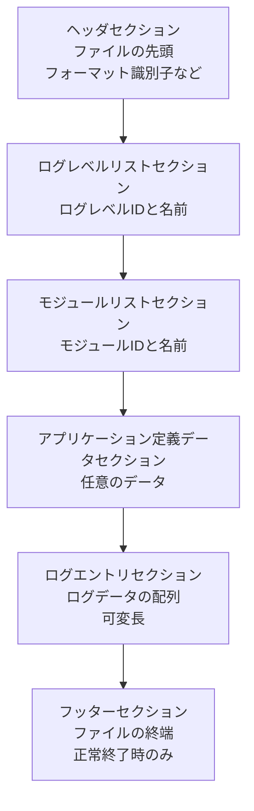

#  HSSBLogger ログファイルフォーマット仕様書


## 1. 概要

この仕様書は、HSSBLoggerが使用するオリジナルのログファイルフォーマットについて説明します。<br>
HSSBLoggerのログファイルフォーマットは、効率的なデータ保存と高速な読み取りを目的としており、<br>
設計のコンセプトとして、できるだけファイルサイズを小さくすることを目指しています。


### 1.1 ファイルサイズ削減のための工夫
---

* ログレベル名やモジュール名などの繰り返し使用される文字列は、別セクションで一括管理し、<br>
  ログエントリ内ではID参照のみを行うことで、冗長なデータの保存を避けています。
  - また、ログレベル名やモジュール名をファイル内に固定長に保存することで、<br>
    将来、テキストファイルに変換する場合や、専用ビューワーを開発し表示する場合においても、<br>
    速やかに文字列に変換できます

* ログエントリはバイナリ形式で保存され、テキスト形式に比べてデータサイズを削減しています。

## 2. ファイル構造


HSSBLoggerのログファイルは、先頭から以下のセクションで構成されています。



* フッターセクションについて
    - このセクションを持つことで、ログファイルが正常に終了したかどうかを判定できます
    - アプリケーション正常終了時のみにフッターセクションが書き込まれます
      - そのため、このセクションがない場合、アプリケーションが異常終了した可能性があることを示します 

### 2.1 前提説明

---

Windows環境を前提としているため、エンディアンはリトルエンディアンを採用しています。<br>
文字エンコードは、UTF-16LE(wchar_t準拠)を採用しています。<br>

char配列は正確な文字コードが判断がつかないため(環境により、Shift_JISの場合があれば、UTF-8の場合がある)、<br>
本フォーマットでは、wchar_t配列を使用することを採用しました。

### 2.2 ヘッダセクション

---

ヘッダセクションは、ファイルの先頭に位置し、以下のように定義されます


```cpp
struct HSSBLoggerFileHeader {
    UUID        FormatID;                   // フォーマット識別子
    uint32_t    FormatVersion;              // フォーマットバージョン
    UUID        ApplicationID;              // アプリケーション識別子
    uint16_t    ApplicationMajorVersion;    // アプリケーションメジャーバージョン
    uint16_t    ApplicationMinorVersion;    // アプリケーションマイナーバージョン
    DWORD       ProcessID;                  // プロセスID
    uint64_t    FullFileSize;               // 本構造体を含めた完全なファイルサイズ
    uint32_t    LogEntryFinalCount;         // ログエントリ最終カウント
    uint32_t    LogEntrySHA256[8];          // ログエントリセクションSHA-256ハッシュ値 (無効の場合は0で初期化)
};
```


#### FormatID

* 初期値： 固定値
* 説明： HSSBLoggerのログファイルフォーマットを識別するためのUUID
  - HSSBLoggerでは、特定のUUIDを使用します


#### FormatVersion

* 初期値： 1
* 説明： ログファイルフォーマットのバージョンを示す整数値
  - 現在のバージョンは1です
  - 将来的にフォーマットが変更された場合に、この値をインクリメントします

#### ApplicationID

* 初期値： 任意
* 説明： ログファイルを生成したアプリケーションを識別するためのUUID
  - アプリケーションごとに一意のUUIDを割り当てることを推奨します
  - これにより、複数のアプリケーションが同じフォーマットでログファイルを生成した場合でも、<br>
    どのアプリケーションが生成したかを識別できます


#### ApplicationMajorVersion

* 初期値： 任意
* 説明： ログファイルを生成したアプリケーションのメジャーバージョンを示す整数値
  - アプリケーションのバージョン管理に使用されます
  - メジャーバージョンが変更された場合に、この値をインクリメントします

#### ApplicationMinorVersion

* 初期値： 任意
* 説明： ログファイルを生成したアプリケーションのマイナーバージョンを示す整数値
  - アプリケーションのバージョン管理に使用されます
  - マイナーバージョンが変更された場合に、この値をインクリメントします

#### ProcessID

* 初期値： 任意
* 説明： ログファイルを生成したプロセスのIDを示すDWORD値
  - WindowsのGetCurrentProcessId関数で取得される値を使用します

#### FullFileSize

* 初期値： 0
* 説明： 本構造体を含めた完全なファイルサイズを示します
  - ファイル作成時は0で初期化され、ファイル書き込み完了時に最終的なファイルサイズが設定されます
  - ファイルの読み取り時に、FullFileSizeとフッターセクションのBeforeFileSizeの合計が<br>
    実際のファイルサイズと一致するかを検証することで、ファイルが完全であることを確認できます


#### LogEntryFinalCount

* 初期値： 0
* 説明： ログエントリセクション内で最後に書き込まれたログエントリのカウント番号を示します
  - ログエントリが存在しない場合は0となります
  - ファイル作成時は0で初期化され、ファイル書き込み完了時に設定されます

#### LogEntrySHA256

* 初期値： 0
* 説明： ログエントリセクション全体のSHA-256ハッシュ値を格納します
  - ファイル作成時は0で初期化され、ファイル書き込み完了時に計算されたハッシュ値が設定されます
  - このフィールドを使用することで、ログエントリセクションの整合性を検証できます
  - ログエントリセクションの内容が変更されていないことを確認するために使用されます


### 2.3 ログレベルリストセクション

---

ログレベルリストセクションには以下の構造体が使用されます

```cpp
struct HSSBLoggerLogLevelListHeader{
    uint32_t    LevelCount;                 // ログレベル数
    uint32_t    LevelNameLength;            // NUL文字を含むログレベル名の長さ (バイト単位)
};

struct HSSBLoggerLogLevelListEntry {

    // ログレベルID
    uint8_t     LevelID;

    // ビューワー向け色情報
    COLORREF    BackgroundColorForViewer;
    
    // ビューワー向け色情報
    COLORREF    ForegroundColorForViewer;

    // アプリケーション定義値 (未使用時は0)
    uint64_t    ApplicationDefinedValue;
    
    // ログレベル名 (長さはHSSBLoggerLogLevelListHeader::LevelNameLengthによって決定されます、UTF-16LEエンコード)
    wchar_t     LevelName[HSSBLoggerLogLevelListHeader::LevelNameLength / sizeof(wchar_t)];

};
```

このセクションを、C++の構造体風に表すと以下のようになります

```cpp
struct HSSBLoggerLogLevelListSection {
    HSSBLoggerLogLevelListHeader Header;    // ログレベルリストヘッダ
    HSSBLoggerLogLevelListEntry  Entries[]; // ログレベルリストエントリ (可変長配列)
};
```


#### LevelCount

* 初期値： 任意
* 説明： ログレベルの総数を示します
  * ファイル作成時に設定されます

#### LevelNameLength

* 初期値： 任意
* 説明： 各ログレベル名の長さをバイト単位で示します
  - NUL文字を含む固定長で保存されます
  - ファイル作成時に設定されます

#### LevelID

* 初期値： 任意
* 説明： 各ログレベルを識別するための一意のIDを示します
  - 0～255の範囲で一意のIDを割り当てることができます
  - 値が小さいものは重大度が低いものとして扱われます

* 値例
  - 例1 (一般的なログレベル名との対応)

    |一般的なログレベル名|LevelID|
    |------------------|-------|
    | TRACE           | 0     |
    | DEBUG           | 1     |
    | INFO            | 2     |
    | WARNING         | 3     |
    | ERROR           | 4     |
    | FATAL           | 5     |

  - 例2 (試験的な機能と本機能が混在しており、試験的な機能の方の重要度を低く取り扱う場合)


    |ログレベル名|LevelID|
    |------------------|-------|
    | EXPERIMENTAL_TRACE   | 0     |
    | EXPERIMENTAL_DEBUG   | 1     |
    | EXPERIMENTAL_INFO    | 2     |
    | EXPERIMENTAL_WARNING | 3     |
    | EXPERIMENTAL_ERROR   | 4     |
    | EXPERIMENTAL_FATAL   | 5     |
    | TRACE           | 10     |
    | DEBUG           | 11     |
    | INFO            | 12     |
    | WARNING         | 13     |
    | ERROR           | 14     |
    | FATAL           | 15     |


#### BackgroundColorForViewer

* 初期値： 任意
* 説明： ログビューワーで使用する背景色をCOLORREF形式で格納します
  - ログレベルに応じた視覚的な区別を提供するために使用されます
  - 例: RGB(255, 0, 0)は赤色を示します

#### ForegroundColorForViewer

* 初期値： 任意
* 説明： ログビューワーで使用する前景色をCOLORREF形式で格納します
  - ログレベルに応じた視覚的な区別を提供するために使用されます
  - 例: RGB(0, 0, 0)は黒色を示します

#### ApplicationDefinedValue

* 初期値： 任意
* 説明： アプリケーションで独自に定義している値を格納できます

#### LevelName

* 初期値： 任意
* 説明： ログレベルの名前をUTF-16LEエンコードで格納する可変長配列です
  - NUL文字で終端されます
  - ファイル作成時に設定されます

* 例
  - "INFO"
  - "WARNING"
  - "ERROR"
  - "DEBUG"
  - "TRACE"
  - "FATAL"

* また、文字列データであるため、以下のように日本語化しても問題ありません
    - "情報"
    - "警告"
    - "エラー"
    - "デバッグ"
    - "トレース"
    - "致命的"


### 2.4 モジュールリストセクション

---

* モジュールリストセクションにはログレベルリストセクションに似た以下の構造体が使用されます

    ```cpp
    struct HSSBLoggerModuleListHeader{
        uint32_t    ModuleCount;         // モジュール数
        uint32_t    ModuleNameLength;    // NUL文字を含むモジュール名の長さ (バイト単位、固定長)
    };

    struct HSSBLoggerModuleListEntry {
        uint16_t    ModuleID;            // モジュールID
        wchar_t     ModuleName[];        // モジュール名 (可変長、UTF-16LEエンコード)
    };
    ```

* このセクションを、C++の構造体風に表すと以下のようになります

    ```cpp
    struct HSSBLoggerModuleListSection {
        HSSBLoggerModuleListHeader Header; // モジュールリストヘッダ
        HSSBLoggerModuleListEntry  Entries[]; // モジュールリストエントリ (可変長配列)
    };
    ```


#### ModuleCount

* 初期値： 任意
* 説明： モジュールの総数を示します
  * ファイル作成時に設定されます 

#### ModuleNameLength

* 初期値： 任意
* 説明： 各モジュール名の長さをバイト単位で示します
  - NUL文字を含む固定長で保存されます
  - ファイル作成時に設定されます    

#### ModuleID

* 初期値： 任意
* 説明： 各モジュールを識別するための一意のIDを示します
  - 0～65535の範囲で一意のIDを割り当てることができます
- ファイル作成時に設定されます

#### ModuleName

* 初期値： 任意
* 説明： モジュールの名前をUTF-16LEエンコードで格納する可変長配列です
  - NUL文字で終端されます
  - ファイル作成時に設定されます

### 2.5 アプリケーション定義データセクション
---

ログエントリセクションには以下の構造体が使用されます (C++の構造体風に表現) <br>
このセクションを利用することで、ログエントリに依存しないアプリケーション固有のデータをログファイルに保存できます。<br>

```cpp
struct HSSBLoggerAppDefinedDataHeader {
    uint32_t    DataLength;             // データ長 (バイト単位)
    uint8_t     Data[DataLength];       // アプリケーション定義データ (バイナリデータ)
};
```


#### DataLength

* 初期値： 任意
* 説明： アプリケーション定義データの長さをバイト単位で示します
  - ファイル作成時に設定されます
  - 0の場合、Dataフィールドは存在しません

#### Data

* 初期値： 任意
* 説明： アプリケーション定義データを格納する可変長配列です
  - 長さはDataLengthで指定されます
  - アプリケーション定義の形式で保存されます
  - ファイル作成時に設定されます

### 2.6 ログエントリセクション

---

ログエントリセクションには以下の構造体が使用されます (C++の構造体風に表現) <br>
1つのログファイルあたり、このエントリーは0個以上存在します。

```cpp
struct HSSBLoggerLogEntry {
    SYSTEMTIME  Timestamp;                       // タイムスタンプ (UTC)
    uint32_t    EntryID;                         // エントリID (連番)
    uint32_t    ThreadID;                        // スレッドID
    uint8_t     LogLevelID;                      // ログレベルID
    uint16_t    ModuleID;                        // モジュールID
    uint32_t    MessageLength;                   // メッセージ長 (バイト単位)
    uint32_t    DumpLength;                      // ダンプデータ長 (バイト単位、0の場合はダンプデータ無し)
    uint8_t     DumpTypeID;                      // ダンプデータタイプID (0の場合はダンプデータ無し、それ以外はアプリケーション定義)
    uint8_t     DumpEncodeMode;                  // ダンプデータエンコードモード (現在は未使用、0固定)
    uint32_t    DumpOriginalLength;              // ダンプデータ元サイズ (エンコードされている場合の元のサイズ、未エンコードの場合はDumpLengthと同じ)
    uint32_t    DumpOriginalCRC32;               // ダンプデータのCRC32値 (エンコードされている場合は元データのCRC32)
    wchar_t     Message[MessageLength];          // ログメッセージ (長さはMessageLength、UTF-16LEエンコード)
    uint8_t     DumpData[DumpLength];            // ダンプデータ (長さはDumpLength、バイナリデータ)
};
```

#### Timestamp

* 初期値： 現在のUTC時刻
* 説明： ログエントリのタイムスタンプを示します
  - SYSTEMTIME構造体で表され、UTC時刻で保存されます
  
#### EntryID

* 初期値： 連番
* 説明： ログエントリの一意のIDを示します
    - ログエントリが追加されるごとにインクリメントされます

#### ThreadID

* 初期値： 現在のスレッドID
* 説明： ログエントリを生成したスレッドのIDを示します
  - WindowsのGetCurrentThreadId関数で取得される値を使用します

#### LogLevelID

* 初期値： ログレベルリストのID
* 説明： ログエントリのログレベルを識別するためのIDを示します
  - ログレベルリストセクションで定義されたLevelIDと対応します
  - ログエントリの重要度を示すために使用されます
  - 例えば、DEBUG、INFO、WARNING、ERRORなどのログレベルを識別するために使用されます

#### ModuleID

* 初期値： モジュールリストのID
* 説明： ログエントリのモジュールを識別するためのIDを示します
  - モジュールリストセクションで定義されたModuleIDと対応します
  - ログエントリがどのモジュールから生成されたかを識別するために使用されます

#### MessageLength

* 初期値： 任意
* 説明： ログメッセージの長さをバイト単位で示します
  - ログメッセージはUTF-16LEエンコードで保存され、NUL文字で終端されます

#### DumpLength

* 初期値： 任意
* 説明： ダンプデータの長さをバイト単位で示します
  - 0の場合はダンプデータが存在しないことを示します

#### DumpTypeID

* 初期値： 任意
* 説明： ダンプデータのタイプを識別するためのIDを示します
  - 0の場合はダンプデータが存在しないことを示します
  - それ以外の値はアプリケーション定義で使用されます

#### DumpEncodeMode


* 初期値： 0
* 説明： ダンプデータのエンコードモードを示します
  - 現在は未使用で0に固定されています

#### DumpOriginalLength

* 初期値： 任意
* 説明： ダンプデータの元のサイズを示します
  - エンコードされている場合の元のサイズを示します
  - 未エンコードの場合はDumpLengthと同じ値になります

#### DumpOriginalCRC32

* 初期値： 任意
* 説明： ダンプデータのCRC32値を示します
  - エンコードされている場合は元データのCRC32値を示します
  - データの整合性を確認するために使用されます
  - CRC32アルゴリズムを使用して計算されます

#### Message

* 初期値： 任意
* 説明： ログメッセージをUTF-16LEエンコードで格納する可変長配列です
  - 長さはMessageLengthで指定されます
  - NUL文字で終端されます
  

#### DumpData

* 初期値： 任意
* 説明： ダンプデータを格納する可変長配列です
  - 長さはDumpLengthで指定されます
  - バイナリデータ形式で保存されます


### 2.7 フッターセクション

---


フッターセクションには以下の構造体が使用されます (C++の構造体風に表現)

```cpp
struct HSSBLoggerFileFooter {
    uint64_t    BeforeFileSize;         // フッター直前までのファイルサイズ
    UUID        EndOfFileMarker;        // EOFマーカー (特定のUUIDを使用)
};
```

#### BeforeFileSize

* 初期値： 0
* 説明： フッターセクションの直前までのファイルサイズを示します
  - ファイル作成時は0で初期化され、ファイル書き込み完了時に設定されます
  - ヘッダセクションのFullFileSizeと合わせて、ファイル全体の整合性を確認するために使用できます
  - 例えば、以下のような式が成り立つかを確認することで整合性を確認できます
    - FullFileSize = BeforeFileSize + フッターセクションのサイズ   

#### EndOfFileMarker

* 初期値： 固定値
* 説明： HSSBLoggerのログファイルの終端を示すためのUUID
  - HSSBLoggerでは、特定のUUIDを使用します


## 3. 定義

### 3.1 フォーマット識別子 (FormatID)

HSSBLoggerのログファイルフォーマットを識別するためのUUIDは以下の通りです。<br>
(※例示用のUUIDです。実際の実装では異なるUUIDを生成したものを使用してください)<br>

```
{12345678-1234-1234-1234-1234567890AB}
```

UUIDはWindows SDK上では、GUIDと同じであり、Visual Studioの付属ツール(`guidgen.exe`)や、<br>

[Win32 APIのUuidCreate 関数](https://learn.microsoft.com/ja-jp/windows/win32/api/rpcdce/nf-rpcdce-uuidcreate)
を使用するなどで生成可能です。

---


### 3.2 EOFマーカー (EndOfFileMarker)

HSSBLoggerのログファイルの終端を示すためのUUIDは以下の通りです。<br>
(※例示用のUUIDです。実際の実装では異なるUUIDを生成したものを使用してください)<br>

```
{87654321-4321-4321-4321-BA0987654321}
```


---

### 3.3 拡張子について

HSSBLoggerのログファイルは、拡張子として「.hssblog」を使用することを推奨します。<br>
この拡張子を使用することで、HSSBLoggerのログファイルであることを容易に識別できます。<br>
ただし、アプリケーション定義の拡張子を使用して問題ありません。

---

## 4. 実装時の注意事項


* 構造体については、設定や環境によりアライメントが変化する可能性があるため、<br>
  実装時には#pragma packディレクティブなどを使用して、アライメントを固定することを推奨します
  - 例

    ```cpp
    #pragma pack(push, 1) // 1バイトアライメントに設定

    struct HSSBLoggerLogLevelListHeader{
        uint32_t    LevelCount;                 // ログレベル数
        uint32_t    LevelNameLength;            // NUL文字を含むログレベル名の長さ (バイト単位、固定長)
    };

    #pragma pack(pop) // 元のアライメントに戻す
    ```


---

## 5. 本仕様書の注意事項

* 本仕様書はHSSBLoggerのログファイルフォーマットに関するものであり、<br>
  HSSBLogger自体の使用方法やAPI仕様については含まれていません